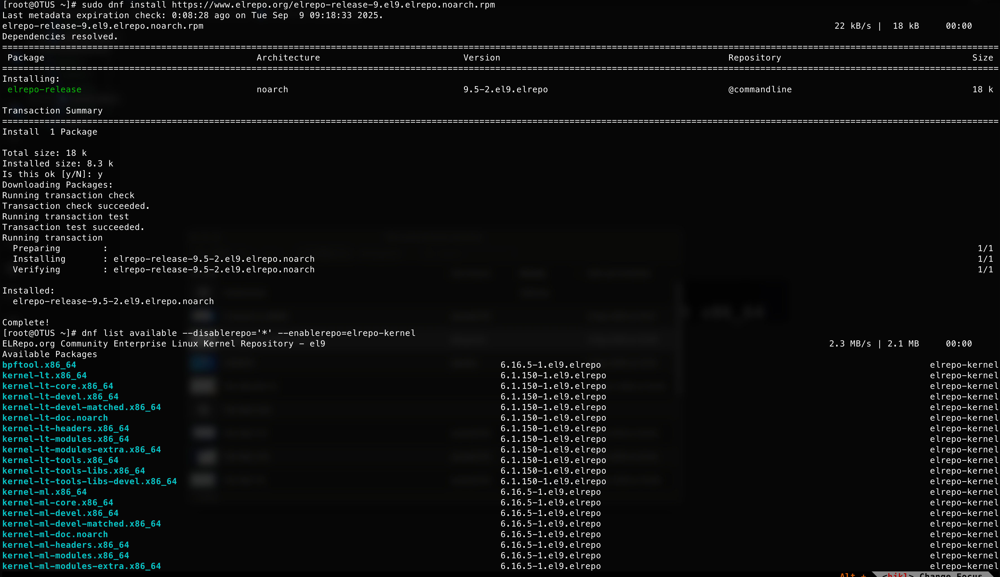
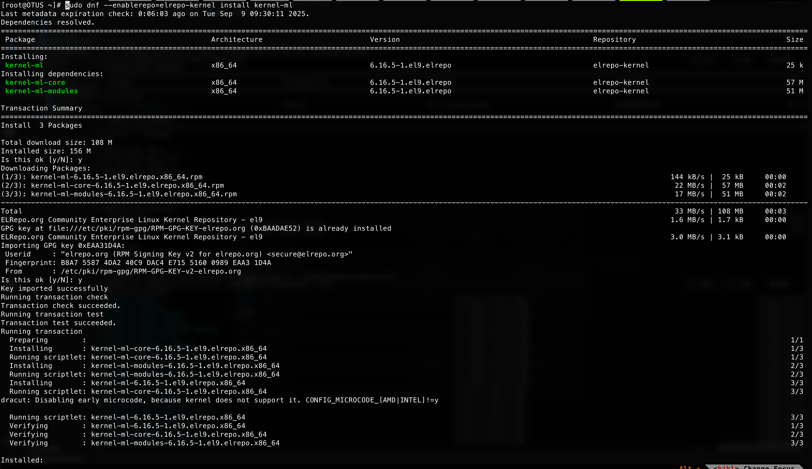
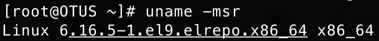

# Домашнее задание: обновление ядра Linux

Цель домашнего задания:  
Научиться обновлять ядро в ОС Linux.

Описание:  
1. Запустить ВМ.  
2. Обновить ядро ОС на новейшую стабильную версию из mainline-репозитория.  
3. Оформить отчет в README-файле в GitHub-репозитории.  

---

```bash
[root@OTUS ~]# cat /etc/os-release
NAME="Rocky Linux"
VERSION="9.1 (Blue Onyx)"
ID="rocky"
ID_LIKE="rhel centos fedora"
VERSION_ID="9.1"
PLATFORM_ID="platform:el9"
PRETTY_NAME="Rocky Linux 9.1 (Blue Onyx)"
ANSI_COLOR="0;32"
LOGO="fedora-logo-icon"
CPE_NAME="cpe:/o:rocky:rocky:9::baseos"
HOME_URL="https://rockylinux.org/"
BUG_REPORT_URL="https://bugs.rockylinux.org/"
ROCKY_SUPPORT_PRODUCT="Rocky-Linux-9"
ROCKY_SUPPORT_PRODUCT_VERSION="9.1"
REDHAT_SUPPORT_PRODUCT="Rocky Linux"
REDHAT_SUPPORT_PRODUCT_VERSION="9.1"

[root@OTUS ~]# uname -r
5.14.0-162.6.1.el9_1.x86_64

[root@OTUS ~]# sudo rpm --import https://www.elrepo.org/RPM-GPG-KEY-elrepo.org
[root@OTUS ~]# sudo dnf install https://www.elrepo.org/elrepo-release-9.el9.elrepo.noarch.rpm

[root@OTUS ~]# dnf list available --disablerepo='*' --enablerepo=elrepo-kernel
ELRepo.org Community Enterprise Linux Kernel Repository - el9                                                                                               2.3 MB/s | 2.1 MB     00:00
Available Packages
bpftool.x86_64                                                                                6.16.5-1.el9.elrepo                                                              elrepo-kernel
kernel-lt.x86_64                                                                              6.1.150-1.el9.elrepo                                                             elrepo-kernel
kernel-lt-core.x86_64                                                                         6.1.150-1.el9.elrepo                                                             elrepo-kernel
kernel-lt-devel.x86_64                                                                        6.1.150-1.el9.elrepo                                                             elrepo-kernel
kernel-lt-devel-matched.x86_64                                                                6.1.150-1.el9.elrepo                                                             elrepo-kernel
kernel-lt-doc.noarch                                                                          6.1.150-1.el9.elrepo                                                             elrepo-kernel
kernel-lt-headers.x86_64                                                                      6.1.150-1.el9.elrepo                                                             elrepo-kernel
kernel-lt-modules.x86_64                                                                      6.1.150-1.el9.elrepo                                                             elrepo-kernel
kernel-lt-modules-extra.x86_64                                                                6.1.150-1.el9.elrepo                                                             elrepo-kernel
kernel-lt-tools.x86_64                                                                        6.1.150-1.el9.elrepo                                                             elrepo-kernel
kernel-lt-tools-libs.x86_64                                                                   6.1.150-1.el9.elrepo                                                             elrepo-kernel
kernel-lt-tools-libs-devel.x86_64                                                             6.1.150-1.el9.elrepo                                                             elrepo-kernel
kernel-ml.x86_64                                                                              6.16.5-1.el9.elrepo                                                              elrepo-kernel
kernel-ml-core.x86_64                                                                         6.16.5-1.el9.elrepo                                                              elrepo-kernel
kernel-ml-devel.x86_64                                                                        6.16.5-1.el9.elrepo                                                              elrepo-kernel
kernel-ml-devel-matched.x86_64                                                                6.16.5-1.el9.elrepo                                                              elrepo-kernel
kernel-ml-doc.noarch                                                                          6.16.5-1.el9.elrepo                                                              elrepo-kernel
kernel-ml-headers.x86_64                                                                      6.16.5-1.el9.elrepo                                                              elrepo-kernel
kernel-ml-modules.x86_64                                                                      6.16.5-1.el9.elrepo                                                              elrepo-kernel
kernel-ml-modules-extra.x86_64                                                                6.16.5-1.el9.elrepo                                                              elrepo-kernel
kernel-ml-tools.x86_64                                                                        6.16.5-1.el9.elrepo                                                              elrepo-kernel
kernel-ml-tools-libs.x86_64                                                                   6.16.5-1.el9.elrepo                                                              elrepo-kernel
kernel-ml-tools-libs-devel.x86_64                                                             6.16.5-1.el9.elrepo                                                              elrepo-kernel
perf.x86_64                                                                                   6.16.5-1.el9.elrepo                                                              elrepo-kernel
python3-perf.x86_64                                                                           6.16.5-1.el9.elrepo                                                              elrepo-kernel


sudo dnf --enablerepo=elrepo-kernel install kernel-ml
Last metadata expiration check: 0:06:03 ago on Tue Sep  9 09:30:11 2025.
Dependencies resolved.
============================================================================================================================================================================================
 Package                                         Architecture                         Version                                             Repository                                   Size
============================================================================================================================================================================================
Installing:
 kernel-ml                                       x86_64                               6.16.5-1.el9.elrepo                                 elrepo-kernel                                25 k
Installing dependencies:
 kernel-ml-core                                  x86_64                               6.16.5-1.el9.elrepo                                 elrepo-kernel                                57 M
 kernel-ml-modules                               x86_64                               6.16.5-1.el9.elrepo                                 elrepo-kernel                                51 M

Transaction Summary
============================================================================================================================================================================================
Install  3 Packages

Total download size: 108 M
Installed size: 156 M
Is this ok [y/N]: y
Downloading Packages:
(1/3): kernel-ml-6.16.5-1.el9.elrepo.x86_64.rpm                                                                                                             144 kB/s |  25 kB     00:00
(2/3): kernel-ml-core-6.16.5-1.el9.elrepo.x86_64.rpm                                                                                                         22 MB/s |  57 MB     00:02
(3/3): kernel-ml-modules-6.16.5-1.el9.elrepo.x86_64.rpm                                                                                                      17 MB/s |  51 MB     00:02
--------------------------------------------------------------------------------------------------------------------------------------------------------------------------------------------
Total                                                                                                                                                        33 MB/s | 108 MB     00:03
ELRepo.org Community Enterprise Linux Kernel Repository - el9                                                                                               1.6 MB/s | 1.7 kB     00:00
GPG key at file:///etc/pki/rpm-gpg/RPM-GPG-KEY-elrepo.org (0xBAADAE52) is already installed
ELRepo.org Community Enterprise Linux Kernel Repository - el9                                                                                               3.0 MB/s | 3.1 kB     00:00
Importing GPG key 0xEAA31D4A:
 Userid     : "elrepo.org (RPM Signing Key v2 for elrepo.org) <secure@elrepo.org>"
 Fingerprint: B8A7 5587 4DA2 40C9 DAC4 E715 5160 0989 EAA3 1D4A
 From       : /etc/pki/rpm-gpg/RPM-GPG-KEY-v2-elrepo.org
Is this ok [y/N]: y
Key imported successfully
Running transaction check
Transaction check succeeded.
Running transaction test
Transaction test succeeded.
Running transaction
  Preparing        :                                                                                                                                                                    1/1
  Installing       : kernel-ml-core-6.16.5-1.el9.elrepo.x86_64                                                                                                                          1/3
  Running scriptlet: kernel-ml-core-6.16.5-1.el9.elrepo.x86_64                                                                                                                          1/3
  Installing       : kernel-ml-modules-6.16.5-1.el9.elrepo.x86_64                                                                                                                       2/3
  Running scriptlet: kernel-ml-modules-6.16.5-1.el9.elrepo.x86_64                                                                                                                       2/3
  Installing       : kernel-ml-6.16.5-1.el9.elrepo.x86_64                                                                                                                               3/3
  Running scriptlet: kernel-ml-core-6.16.5-1.el9.elrepo.x86_64                                                                                                                          3/3
dracut: Disabling early microcode, because kernel does not support it. CONFIG_MICROCODE_[AMD|INTEL]!=y

  Running scriptlet: kernel-ml-6.16.5-1.el9.elrepo.x86_64                                                                                                                               3/3
  Verifying        : kernel-ml-6.16.5-1.el9.elrepo.x86_64                                                                                                                               1/3
  Verifying        : kernel-ml-core-6.16.5-1.el9.elrepo.x86_64                                                                                                                          2/3
  Verifying        : kernel-ml-modules-6.16.5-1.el9.elrepo.x86_64                                                                                                                       3/3

Installed:
  kernel-ml-6.16.5-1.el9.elrepo.x86_64                      kernel-ml-core-6.16.5-1.el9.elrepo.x86_64                      kernel-ml-modules-6.16.5-1.el9.elrepo.x86_64

Complete!

[root@OTUS ~]# sed -i 's/^GRUB_DEFAULT.*/GRUB_DEFAULT=0/' /etc/default/grub
[root@OTUS ~]# grub2-mkconfig -o /boot/grub2/grub.cfg
[root@OTUS ~]# reboot

[root@OTUS ~]# uname -r
6.16.5-1.el9.elrepo.x86_64
```





