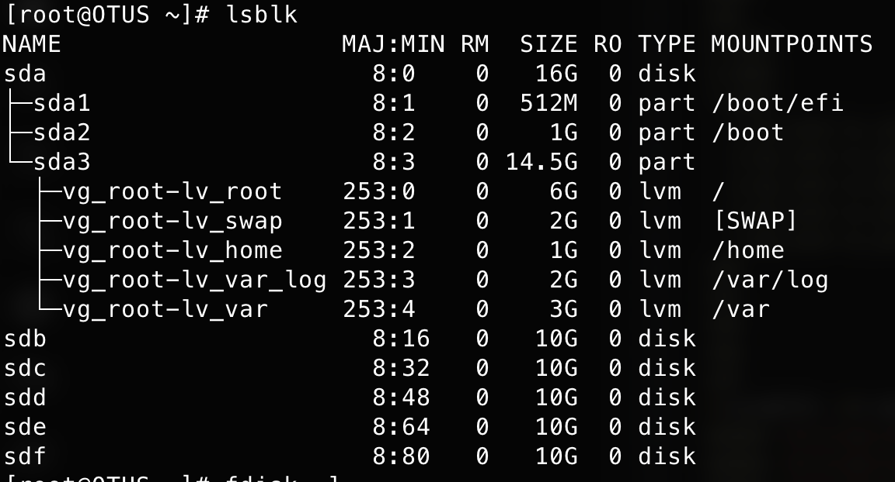
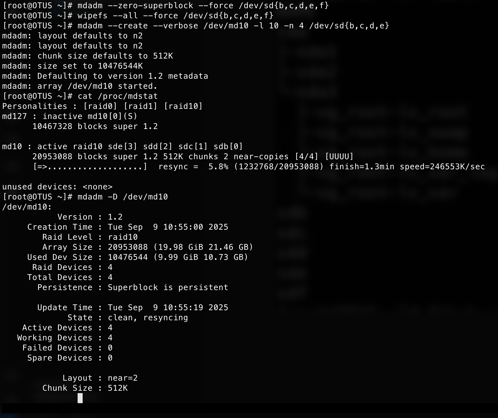
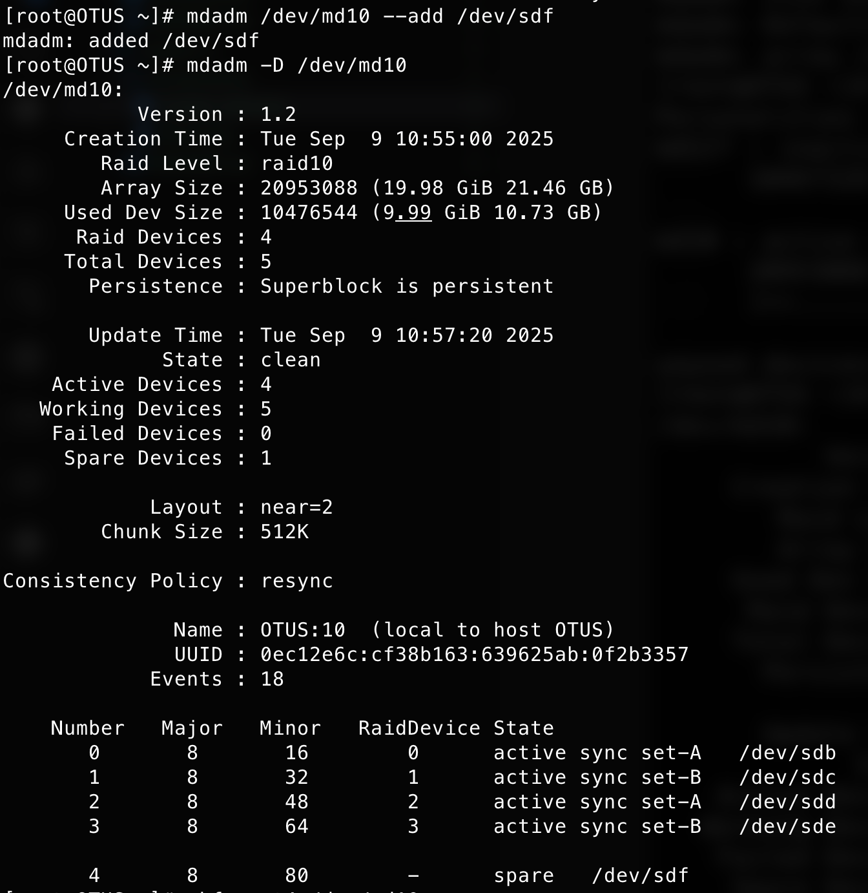
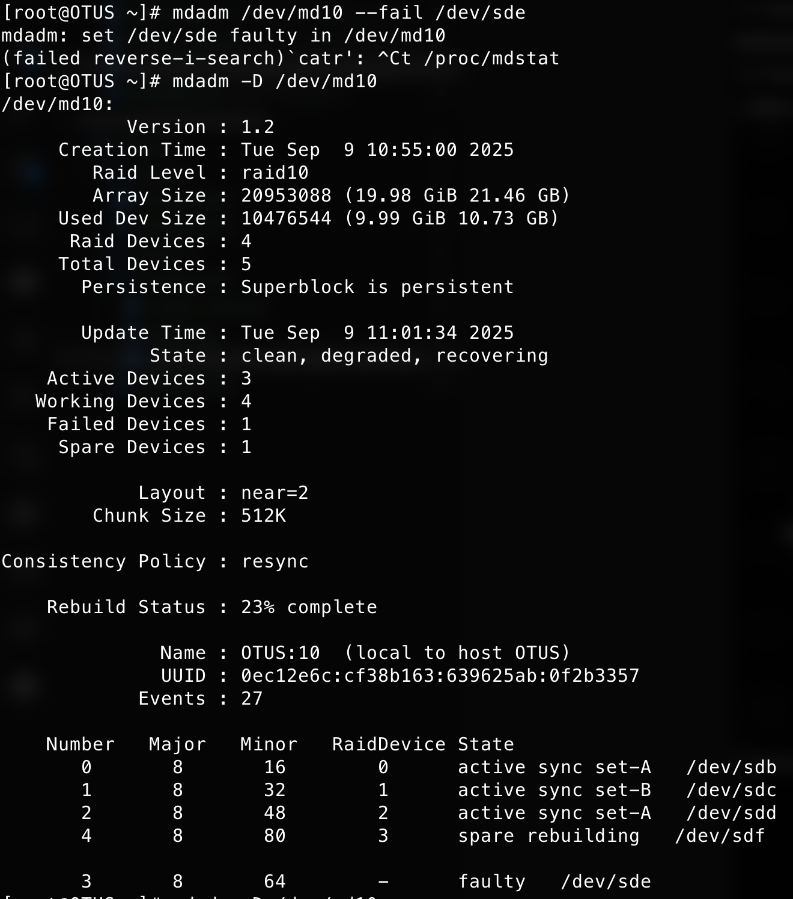
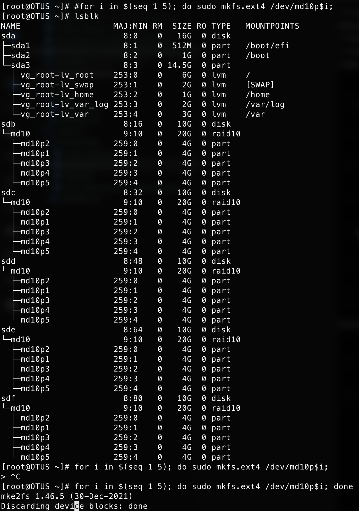
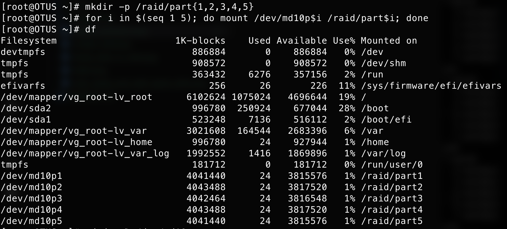

Цель домашнего задания:  
Научиться работать с mdadm

Описание:  
1. Добавить в виртуальную машину несколько дисков
2. Собрать RAID-0/1/5/10 на выбор
3. Сломать и починить RAID
4. Создать GPT таблицу, пять разделов и смонтировать их в системе.

---

```bash
[root@OTUS ~]# lsblk
NAME                   MAJ:MIN RM  SIZE RO TYPE MOUNTPOINTS
sda                      8:0    0   16G  0 disk
├─sda1                   8:1    0  512M  0 part /boot/efi
├─sda2                   8:2    0    1G  0 part /boot
└─sda3                   8:3    0 14.5G  0 part
  ├─vg_root-lv_root    253:0    0    6G  0 lvm  /
  ├─vg_root-lv_swap    253:1    0    2G  0 lvm  [SWAP]
  ├─vg_root-lv_home    253:2    0    1G  0 lvm  /home
  ├─vg_root-lv_var_log 253:3    0    2G  0 lvm  /var/log
  └─vg_root-lv_var     253:4    0    3G  0 lvm  /var
sdb                      8:16   0   10G  0 disk
sdc                      8:32   0   10G  0 disk
sdd                      8:48   0   10G  0 disk
sde                      8:64   0   10G  0 disk
sdf                      8:80   0   10G  0 disk
[root@OTUS ~]# mdadm --zero-superblock --force /dev/sd{b,c,d,e,f}
mdadm: Unrecognised md component device - /dev/sdb
mdadm: Unrecognised md component device - /dev/sdc
mdadm: Unrecognised md component device - /dev/sdd
mdadm: Unrecognised md component device - /dev/sde
mdadm: Unrecognised md component device - /dev/sdf
[root@OTUS ~]# wipefs --all --force /dev/sd{b,c,d,e,f}
[root@OTUS ~]# mdadm --create --verbose /dev/md10 -l 10 -n 4 /dev/sd{b,c,d,e}
mdadm: layout defaults to n2
mdadm: layout defaults to n2
mdadm: chunk size defaults to 512K
mdadm: size set to 10476544K
mdadm: Defaulting to version 1.2 metadata
mdadm: array /dev/md10 started.
[root@OTUS ~]# cat /proc/mdstat
Personalities : [raid0] [raid1] [raid10]
md10 : active raid10 sde[3] sdd[2] sdc[1] sdb[0]
      20953088 blocks super 1.2 512K chunks 2 near-copies [4/4] [UUUU]
      [=>...................]  resync =  5.8% (1232768/20953088) finish=1.3min speed=246553K/sec

unused devices: <none>
[root@OTUS ~]# mdadm -D /dev/md10
/dev/md10:
           Version : 1.2
     Creation Time : Tue Sep  9 10:55:00 2025
        Raid Level : raid10
        Array Size : 20953088 (19.98 GiB 21.46 GB)
     Used Dev Size : 10476544 (9.99 GiB 10.73 GB)
      Raid Devices : 4
     Total Devices : 4
       Persistence : Superblock is persistent

       Update Time : Tue Sep  9 10:55:19 2025
             State : clean, resyncing
    Active Devices : 4
   Working Devices : 4
    Failed Devices : 0
     Spare Devices : 0

            Layout : near=2
        Chunk Size : 512K

Consistency Policy : resync

     Resync Status : 22% complete

              Name : OTUS:10  (local to host OTUS)
              UUID : 0ec12e6c:cf38b163:639625ab:0f2b3357
            Events : 3

    Number   Major   Minor   RaidDevice State
       0       8       16        0      active sync set-A   /dev/sdb
       1       8       32        1      active sync set-B   /dev/sdc
       2       8       48        2      active sync set-A   /dev/sdd
       3       8       64        3      active sync set-B   /dev/sde
[root@OTUS ~]# cat /proc/mdstat
Personalities : [raid0] [raid1] [raid10]
md10 : active raid10 sde[5](S) sdf[4] sdd[2] sdc[1] sdb[0]
      20953088 blocks super 1.2 512K chunks 2 near-copies [4/4] [UUUU]

unused devices: <none>
[root@OTUS ~]# mdadm /dev/md10 --add /dev/sdf
mdadm: added /dev/sdf
[root@OTUS ~]# mdadm -D /dev/md10
/dev/md10:
           Version : 1.2
     Creation Time : Tue Sep  9 10:55:00 2025
        Raid Level : raid10
        Array Size : 20953088 (19.98 GiB 21.46 GB)
     Used Dev Size : 10476544 (9.99 GiB 10.73 GB)
      Raid Devices : 4
     Total Devices : 5
       Persistence : Superblock is persistent

       Update Time : Tue Sep  9 10:57:20 2025
             State : clean
    Active Devices : 4
   Working Devices : 5
    Failed Devices : 0
     Spare Devices : 1

            Layout : near=2
        Chunk Size : 512K

Consistency Policy : resync

              Name : OTUS:10  (local to host OTUS)
              UUID : 0ec12e6c:cf38b163:639625ab:0f2b3357
            Events : 18

    Number   Major   Minor   RaidDevice State
       0       8       16        0      active sync set-A   /dev/sdb
       1       8       32        1      active sync set-B   /dev/sdc
       2       8       48        2      active sync set-A   /dev/sdd
       3       8       64        3      active sync set-B   /dev/sde

       4       8       80        -      spare   /dev/sdf

[root@OTUS ~]# mdadm /dev/md10 --fail /dev/sde
mdadm: set /dev/sde faulty in /dev/md10

[root@OTUS ~]# mdadm -D /dev/md10
/dev/md10:
           Version : 1.2
     Creation Time : Tue Sep  9 10:55:00 2025
        Raid Level : raid10
        Array Size : 20953088 (19.98 GiB 21.46 GB)
     Used Dev Size : 10476544 (9.99 GiB 10.73 GB)
      Raid Devices : 4
     Total Devices : 5
       Persistence : Superblock is persistent

       Update Time : Tue Sep  9 11:01:34 2025
             State : clean, degraded, recovering
    Active Devices : 3
   Working Devices : 4
    Failed Devices : 1
     Spare Devices : 1

            Layout : near=2
        Chunk Size : 512K

Consistency Policy : resync

    Rebuild Status : 23% complete

              Name : OTUS:10  (local to host OTUS)
              UUID : 0ec12e6c:cf38b163:639625ab:0f2b3357
            Events : 27

    Number   Major   Minor   RaidDevice State
       0       8       16        0      active sync set-A   /dev/sdb
       1       8       32        1      active sync set-B   /dev/sdc
       2       8       48        2      active sync set-A   /dev/sdd
       4       8       80        3      spare rebuilding   /dev/sdf

       3       8       64        -      faulty   /dev/sde
[root@OTUS ~]#  mdadm /dev/md10 --remove /dev/sde
mdadm: hot removed /dev/sde from /dev/md10
[root@OTUS ~]# cat /proc/mdstat
Personalities : [raid0] [raid1] [raid10]
md10 : active raid10 sdf[4] sdd[2] sdc[1] sdb[0]
      20953088 blocks super 1.2 512K chunks 2 near-copies [4/4] [UUUU]

unused devices: <none>
[root@OTUS ~]# mdadm /dev/md10 --add /dev/sde

mdadm: added /dev/sde
[root@OTUS ~]# cat /proc/mdstat
Personalities : [raid0] [raid1] [raid10]
md10 : active raid10 sde[5](S) sdf[4] sdd[2] sdc[1] sdb[0]
      20953088 blocks super 1.2 512K chunks 2 near-copies [4/4] [UUUU]

unused devices: <none>
[root@OTUS ~]# mdadm -D /dev/md10
/dev/md10:
           Version : 1.2
     Creation Time : Tue Sep  9 10:55:00 2025
        Raid Level : raid10
        Array Size : 20953088 (19.98 GiB 21.46 GB)
     Used Dev Size : 10476544 (9.99 GiB 10.73 GB)
      Raid Devices : 4
     Total Devices : 5
       Persistence : Superblock is persistent

       Update Time : Tue Sep  9 11:03:26 2025
             State : clean
    Active Devices : 4
   Working Devices : 5
    Failed Devices : 0
     Spare Devices : 1

            Layout : near=2
        Chunk Size : 512K

Consistency Policy : resync

              Name : OTUS:10  (local to host OTUS)
              UUID : 0ec12e6c:cf38b163:639625ab:0f2b3357
            Events : 45

    Number   Major   Minor   RaidDevice State
       0       8       16        0      active sync set-A   /dev/sdb
       1       8       32        1      active sync set-B   /dev/sdc
       2       8       48        2      active sync set-A   /dev/sdd
       4       8       80        3      active sync set-B   /dev/sdf

       5       8       64        -      spare   /dev/sde

[root@OTUS ~]# parted -s /dev/md10 mklabel gpt
[root@OTUS ~]# parted /dev/md10 mkpart primary ext4 0% 20%
Information: You may need to update /etc/fstab.

[root@OTUS ~]# parted /dev/md10 mkpart primary ext4 20% 40%
Information: You may need to update /etc/fstab.

[root@OTUS ~]# parted /dev/md10 mkpart primary ext4 40% 60%
Information: You may need to update /etc/fstab.

[root@OTUS ~]# parted /dev/md10 mkpart primary ext4 60% 80%
Information: You may need to update /etc/fstab.

[root@OTUS ~]# parted /dev/md10 mkpart primary ext4 80% 100%
Information: You may need to update /etc/fstab.

[root@OTUS ~]# #for i in $(seq 1 5); do sudo mkfs.ext4 /dev/md10p$i;
[root@OTUS ~]# lsblk
NAME                   MAJ:MIN RM  SIZE RO TYPE   MOUNTPOINTS
sda                      8:0    0   16G  0 disk
├─sda1                   8:1    0  512M  0 part   /boot/efi
├─sda2                   8:2    0    1G  0 part   /boot
└─sda3                   8:3    0 14.5G  0 part
  ├─vg_root-lv_root    253:0    0    6G  0 lvm    /
  ├─vg_root-lv_swap    253:1    0    2G  0 lvm    [SWAP]
  ├─vg_root-lv_home    253:2    0    1G  0 lvm    /home
  ├─vg_root-lv_var_log 253:3    0    2G  0 lvm    /var/log
  └─vg_root-lv_var     253:4    0    3G  0 lvm    /var
sdb                      8:16   0   10G  0 disk
└─md10                   9:10   0   20G  0 raid10
  ├─md10p2             259:0    0    4G  0 part
  ├─md10p1             259:1    0    4G  0 part
  ├─md10p3             259:2    0    4G  0 part
  ├─md10p4             259:3    0    4G  0 part
  └─md10p5             259:4    0    4G  0 part
sdc                      8:32   0   10G  0 disk
└─md10                   9:10   0   20G  0 raid10
  ├─md10p2             259:0    0    4G  0 part
  ├─md10p1             259:1    0    4G  0 part
  ├─md10p3             259:2    0    4G  0 part
  ├─md10p4             259:3    0    4G  0 part
  └─md10p5             259:4    0    4G  0 part
sdd                      8:48   0   10G  0 disk
└─md10                   9:10   0   20G  0 raid10
  ├─md10p2             259:0    0    4G  0 part
  ├─md10p1             259:1    0    4G  0 part
  ├─md10p3             259:2    0    4G  0 part
  ├─md10p4             259:3    0    4G  0 part
  └─md10p5             259:4    0    4G  0 part
sde                      8:64   0   10G  0 disk
└─md10                   9:10   0   20G  0 raid10
  ├─md10p2             259:0    0    4G  0 part
  ├─md10p1             259:1    0    4G  0 part
  ├─md10p3             259:2    0    4G  0 part
  ├─md10p4             259:3    0    4G  0 part
  └─md10p5             259:4    0    4G  0 part
sdf                      8:80   0   10G  0 disk
└─md10                   9:10   0   20G  0 raid10
  ├─md10p2             259:0    0    4G  0 part
  ├─md10p1             259:1    0    4G  0 part
  ├─md10p3             259:2    0    4G  0 part
  ├─md10p4             259:3    0    4G  0 part
  └─md10p5             259:4    0    4G  0 part
[root@OTUS ~]# for i in $(seq 1 5); do sudo mkfs.ext4 /dev/md10p$i;
> ^C
[root@OTUS ~]# for i in $(seq 1 5); do sudo mkfs.ext4 /dev/md10p$i; done
mke2fs 1.46.5 (30-Dec-2021)
Discarding device blocks: done
Creating filesystem with 1047296 4k blocks and 262144 inodes
Filesystem UUID: 34ed979c-392e-4d39-8c8a-3f070536700d
Superblock backups stored on blocks:
        32768, 98304, 163840, 229376, 294912, 819200, 884736

Allocating group tables: done
Writing inode tables: done
Creating journal (16384 blocks): done
Writing superblocks and filesystem accounting information: done

mke2fs 1.46.5 (30-Dec-2021)
Discarding device blocks: done
Creating filesystem with 1047808 4k blocks and 262144 inodes
Filesystem UUID: 114b0bb7-4947-4051-ac42-ec27ff62d584
Superblock backups stored on blocks:
        32768, 98304, 163840, 229376, 294912, 819200, 884736

Allocating group tables: done
Writing inode tables: done
Creating journal (16384 blocks): done
Writing superblocks and filesystem accounting information: done

mke2fs 1.46.5 (30-Dec-2021)
Discarding device blocks: done
Creating filesystem with 1047552 4k blocks and 262144 inodes
Filesystem UUID: 2e33b8d0-0d9e-489d-b8ce-9b9b3bccbdf2
Superblock backups stored on blocks:
        32768, 98304, 163840, 229376, 294912, 819200, 884736

Allocating group tables: done
Writing inode tables: done
Creating journal (16384 blocks): done
Writing superblocks and filesystem accounting information: done

mke2fs 1.46.5 (30-Dec-2021)
Discarding device blocks: done
Creating filesystem with 1047808 4k blocks and 262144 inodes
Filesystem UUID: b0d60851-703f-4c94-a86c-48801386704f
Superblock backups stored on blocks:
        32768, 98304, 163840, 229376, 294912, 819200, 884736

Allocating group tables: done
Writing inode tables: done
Creating journal (16384 blocks): done
Writing superblocks and filesystem accounting information: done

mke2fs 1.46.5 (30-Dec-2021)
Discarding device blocks: done
Creating filesystem with 1047296 4k blocks and 262144 inodes
Filesystem UUID: 24c56bf6-bbd5-41cb-bd13-a746b801f948
Superblock backups stored on blocks:
        32768, 98304, 163840, 229376, 294912, 819200, 884736

Allocating group tables: done
Writing inode tables: done
Creating journal (16384 blocks): done
Writing superblocks and filesystem accounting information: done

[root@OTUS ~]# mkdir -p /raid/part{1,2,3,4,5}
[root@OTUS ~]# for i in $(seq 1 5); do mount /dev/md10p$i /raid/part$i; done
[root@OTUS ~]# df
Filesystem                     1K-blocks    Used Available Use% Mounted on
devtmpfs                          886884       0    886884   0% /dev
tmpfs                             908572       0    908572   0% /dev/shm
tmpfs                             363432    6276    357156   2% /run
efivarfs                             256      26       226  11% /sys/firmware/efi/efivars
/dev/mapper/vg_root-lv_root      6102624 1075024   4696644  19% /
/dev/sda2                         996780  250924    677044  28% /boot
/dev/sda1                         523248    7136    516112   2% /boot/efi
/dev/mapper/vg_root-lv_var       3021608  164544   2683396   6% /var
/dev/mapper/vg_root-lv_home       996780      24    927944   1% /home
/dev/mapper/vg_root-lv_var_log   1992552    1416   1869896   1% /var/log
tmpfs                             181712       0    181712   0% /run/user/0
/dev/md10p1                      4041440      24   3815576   1% /raid/part1
/dev/md10p2                      4043488      24   3817520   1% /raid/part2
/dev/md10p3                      4042464      24   3816548   1% /raid/part3
/dev/md10p4                      4043488      24   3817520   1% /raid/part4
/dev/md10p5                      4041440      24   3815576   1% /raid/part5
```








