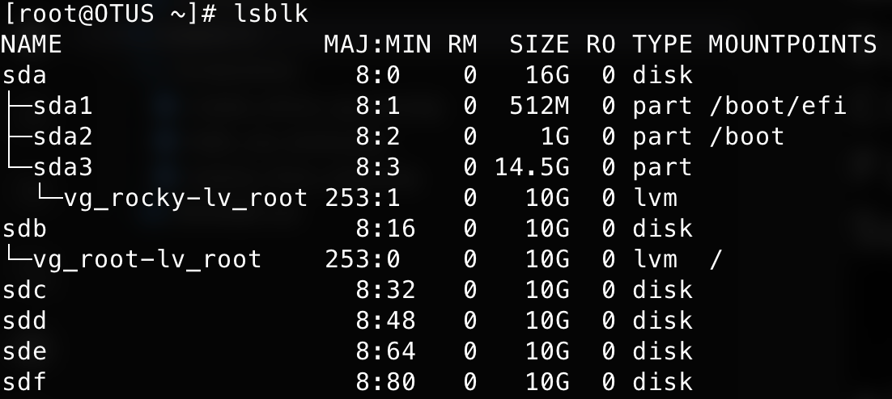
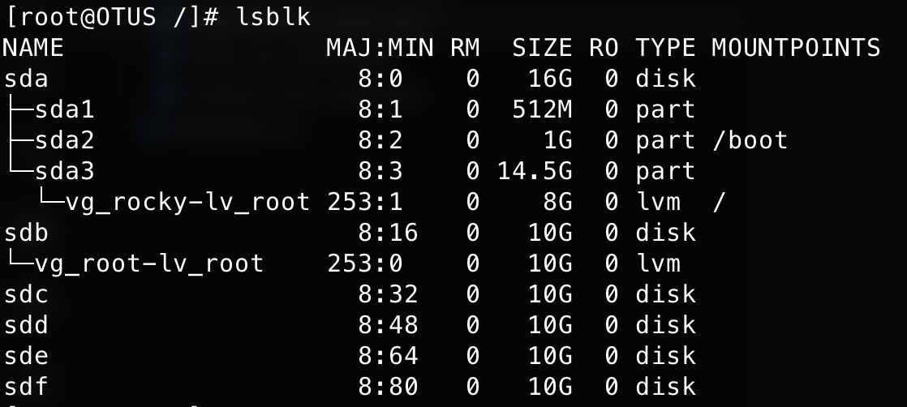
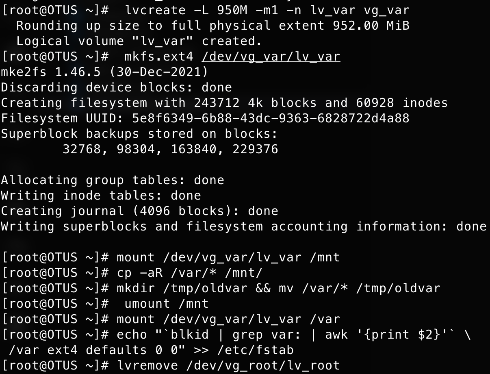
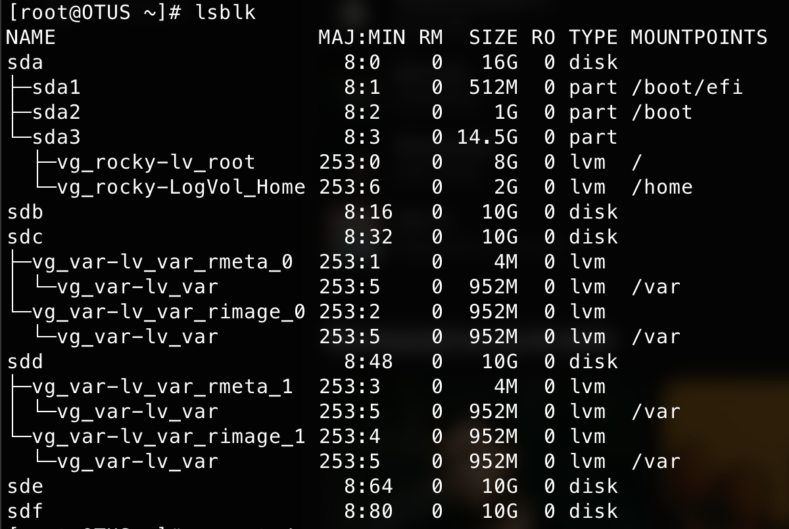
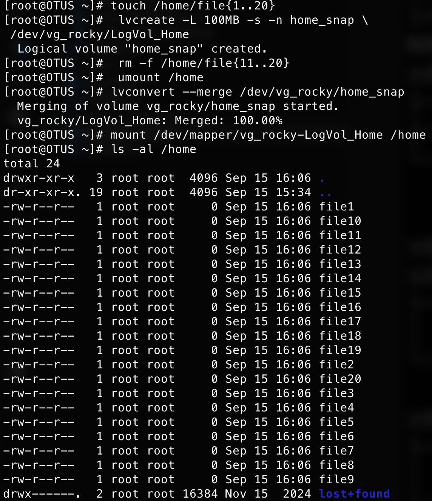

Цель домашнего задания:  
Научиться работать LVM, snapshots

Описание:  
1. На виртуальной машине c LVM.
2. Уменьшить том под / до 8G.
3. Выделить том под /home.
4. Выделить том под /var - сделать в mirror.
5. /home - сделать том для снапшотов.
6. Прописать монтирование в fstab. Попробовать с разными опциями и разными файловыми системами (на выбор).
7. Работа со снапшотами:
8. сгенерить файлы в /home/;
9. снять снапшот;
10. удалить часть файлов;
11. восстановится со снапшота.
* На дисках попробовать поставить btrfs/zfs — с кэшем, снапшотами и разметить там каталог /opt.

---
```bash
[root@OTUS /]# lsblk
NAME                 MAJ:MIN RM  SIZE RO TYPE MOUNTPOINTS
sda                    8:0    0   16G  0 disk
├─sda1                 8:1    0  512M  0 part /boot/efi
├─sda2                 8:2    0    1G  0 part /boot
└─sda3                 8:3    0 14.5G  0 part
  └─vg_rocky-lv_root 253:0    0   10G  0 lvm  /
sdb                    8:16   0   10G  0 disk
sdc                    8:32   0   10G  0 disk
sdd                    8:48   0   10G  0 disk
sde                    8:64   0   10G  0 disk
sdf                    8:80   0   10G  0 disk
[root@OTUS /]# pvcreate /dev/sdb
  Physical volume "/dev/sdb" successfully created.
[root@OTUS /]# vgcreate vg_root /dev/sdb
  Volume group "vg_root" successfully created
[root@OTUS /]# lvcreate -n lv_root -l +100%FREE /dev/vg_root
WARNING: ext4 signature detected on /dev/vg_root/lv_root at offset 1080. Wipe it? [y/n]: y
  Wiping ext4 signature on /dev/vg_root/lv_root.
  Logical volume "lv_root" created.
[root@OTUS /]# mkfs.ext4 /dev/vg_root/lv_root
mke2fs 1.46.5 (30-Dec-2021)
Discarding device blocks: done
Creating filesystem with 2620416 4k blocks and 655360 inodes
Filesystem UUID: cb71438b-6652-49db-9837-8987e235186c
Superblock backups stored on blocks:
        32768, 98304, 163840, 229376, 294912, 819200, 884736, 1605632

Allocating group tables: done
Writing inode tables: done
Creating journal (16384 blocks): done
Writing superblocks and filesystem accounting information: done

[root@OTUS /]# mount /dev/vg_root/lv_root /mnt
[root@OTUS /]# rsync -axHAX / /mnt/
[root@OTUS /]# ls /mnt
afs  bin  boot  dev  etc  home  lib  lib64  lost+found  media  mnt  opt  proc  root  run  sbin  srv  sys  tmp  usr  var
[root@OTUS /]# for i in /proc/ /sys/ /dev/ /run/ /boot/; \
 do mount --bind $i /mnt/$i; done
[root@OTUS /]# chroot /mnt/
[root@OTUS /]# vi /etc/default/grub
[root@OTUS /]# vi /etc/fstab
[root@OTUS /]# grub2-mkconfig -o /boot/grub2/grub.cfg
[root@OTUS /]# dracut -f /boot/initramfs-6.16.7-1.el9.elrepo.x86_64.img 6.16.7-1.el9.elrepo.x86_64
[root@OTUS /]# exit
[root@OTUS /]# reboot

[root@OTUS ~]# lsblk
NAME                 MAJ:MIN RM  SIZE RO TYPE MOUNTPOINTS
sda                    8:0    0   16G  0 disk
├─sda1                 8:1    0  512M  0 part /boot/efi
├─sda2                 8:2    0    1G  0 part /boot
└─sda3                 8:3    0 14.5G  0 part
  └─vg_rocky-lv_root 253:1    0   10G  0 lvm
sdb                    8:16   0   10G  0 disk
└─vg_root-lv_root    253:0    0   10G  0 lvm  /
sdc                    8:32   0   10G  0 disk
sdd                    8:48   0   10G  0 disk
sde                    8:64   0   10G  0 disk
sdf                    8:80   0   10G  0 disk

root@OTUS ~]# lvremove /dev/vg_rocky/lv_root
Do you really want to remove active logical volume vg_rocky/lv_root? [y/n]: y
  Logical volume "lv_root" successfully removed.
[root@OTUS ~]# lvcreate -n vg_rocky/lv_root -L 8G
WARNING: ext4 signature detected on /dev/vg_rocky/lv_root at offset 1080. Wipe it? [y/n]: y
  Wiping ext4 signature on /dev/vg_rocky/lv_root.
  Logical volume "lv_root" created.
[root@OTUS ~]# mkfs.ext4 /dev/vg_rocky/lv_root
mke2fs 1.46.5 (30-Dec-2021)
Discarding device blocks: done
Creating filesystem with 2097152 4k blocks and 524288 inodes
Filesystem UUID: ede83345-a0ec-4bb5-aaa5-75f0a66554db
Superblock backups stored on blocks:
        32768, 98304, 163840, 229376, 294912, 819200, 884736, 1605632

Allocating group tables: done
Writing inode tables: done
Creating journal (16384 blocks): done
Writing superblocks and filesystem accounting information: done

[root@OTUS ~]# mount /dev/mapper/vg_ro
vg_rocky-lv_root  vg_root-lv_root
[root@OTUS ~]# mount /dev/mapper/vg_rocky-lv_root /mnt
[root@OTUS ~]# rsync -axHAX / /mnt/
[root@OTUS ~]# for i in /proc/ /sys/ /dev/ /run/ /boot/; \
 do mount --bind $i /mnt/$i; done
[root@OTUS ~]# chroot /mnt/
[root@OTUS /]# vi /etc/fstab
[root@OTUS /]# vi /etc/default/
[root@OTUS /]# vi /etc/default/grub
[root@OTUS /]# grub2-mkconfig -o /boot/grub2/grub.cfg
Generating grub configuration file ...
File descriptor 3 (pipe:[13854]) leaked on vgs invocation. Parent PID 10446: grub2-probe
File descriptor 9 (pipe:[13878]) leaked on vgs invocation. Parent PID 10446: grub2-probe
File descriptor 3 (pipe:[13854]) leaked on vgs invocation. Parent PID 10446: grub2-probe
File descriptor 9 (pipe:[13878]) leaked on vgs invocation. Parent PID 10446: grub2-probe
File descriptor 3 (pipe:[13854]) leaked on vgs invocation. Parent PID 10533: grub2-probe
File descriptor 9 (pipe:[13878]) leaked on vgs invocation. Parent PID 10533: grub2-probe
File descriptor 3 (pipe:[13854]) leaked on vgs invocation. Parent PID 10533: grub2-probe
File descriptor 9 (pipe:[13878]) leaked on vgs invocation. Parent PID 10533: grub2-probe
Found Rocky Linux 9.1 (Blue Onyx) on /dev/mapper/vg_rocky-lv_root
Found Rocky Linux 9.1 (Blue Onyx) on /dev/mapper/vg_root-lv_root
Adding boot menu entry for UEFI Firmware Settings ...
done

[root@OTUS ~]#  lvcreate -L 950M -m1 -n lv_var vg_var
  Rounding up size to full physical extent 952.00 MiB
  Logical volume "lv_var" created.
[root@OTUS ~]#  mkfs.ext4 /dev/vg_var/lv_var
mke2fs 1.46.5 (30-Dec-2021)
Discarding device blocks: done
Creating filesystem with 243712 4k blocks and 60928 inodes
Filesystem UUID: 5e8f6349-6b88-43dc-9363-6828722d4a88
Superblock backups stored on blocks:
        32768, 98304, 163840, 229376

Allocating group tables: done
Writing inode tables: done
Creating journal (4096 blocks): done
Writing superblocks and filesystem accounting information: done

[root@OTUS ~]# mount /dev/vg_var/lv_var /mnt
[root@OTUS ~]# cp -aR /var/* /mnt/
[root@OTUS ~]# mkdir /tmp/oldvar && mv /var/* /tmp/oldvar
[root@OTUS ~]# umount /mnt
[root@OTUS ~]# mount /dev/vg_var/lv_var /var
[root@OTUS ~]# echo "`blkid | grep var: | awk '{print $2}'` \
 /var ext4 defaults 0 0" >> /etc/fstab"
 
[root@OTUS /]# exit
exit
[root@OTUS ~]# reboot
[root@OTUS ~]# lsblk
NAME                 MAJ:MIN RM  SIZE RO TYPE MOUNTPOINTS
sda                    8:0    0   16G  0 disk
├─sda1                 8:1    0  512M  0 part /boot/efi
├─sda2                 8:2    0    1G  0 part /boot
└─sda3                 8:3    0 14.5G  0 part
  └─vg_rocky-lv_root 253:0    0    8G  0 lvm  /
sdb                    8:16   0   10G  0 disk
sdc                        8:32   0   10G  0 disk
├─vg_var-lv_var_rmeta_0  253:1    0    4M  0 lvm
│ └─vg_var-lv_var        253:5    0  952M  0 lvm  /var
└─vg_var-lv_var_rimage_0 253:2    0  952M  0 lvm
  └─vg_var-lv_var        253:5    0  952M  0 lvm  /var
sdd                        8:48   0   10G  0 disk
├─vg_var-lv_var_rmeta_1  253:3    0    4M  0 lvm
│ └─vg_var-lv_var        253:5    0  952M  0 lvm  /var
└─vg_var-lv_var_rimage_1 253:4    0  952M  0 lvm
  └─vg_var-lv_var        253:5    0  952M  0 lvm  /var
sde                        8:64   0   10G  0 disk
sdf                        8:80   0   10G  0 disk

[root@OTUS ~]# lvremove /dev/vg_root/lv_root
Do you really want to remove active logical volume vg_root/lv_root? [y/n]: y
  Logical volume "lv_root" successfully removed
[root@OTUS ~]# vgremove /dev/vg_root
  Volume group "vg_root" successfully removed
[root@OTUS ~]# pvremove /dev/sdb
  Labels on physical volume "/dev/sdb" successfully wiped
[root@OTUS ~]# lvcreate -n LogVol_Home -L 2G /dev/vg_rocky
  Logical volume "LogVol_Home" created.
[root@OTUS ~]# mkfs.ext4 /dev/mapper/vg_rocky-LogVol_Home
mke2fs 1.46.5 (30-Dec-2021)
Discarding device blocks: done
Creating filesystem with 524288 4k blocks and 131072 inodes
Filesystem UUID: 725b9744-15e7-4721-8232-69790fd931ae
Superblock backups stored on blocks:
        32768, 98304, 163840, 229376, 294912

Allocating group tables: done
Writing inode tables: done
Creating journal (16384 blocks): done
Writing superblocks and filesystem accounting information: done

[root@OTUS ~]# mount /dev/vg_rocky/LogVol_Home /mnt/
[root@OTUS ~]# cp -aR /home/* /mnt/
[root@OTUS ~]# rm -rf /home/*
[root@OTUS ~]#  umount /mnt
[root@OTUS ~]# mount /dev/vg_rocky/LogVol_Home /home
[root@OTUS ~]# echo "`blkid | grep Home | awk '{print $2}'` \
 /home xfs defaults 0 0" >> /etc/fstab
[root@OTUS ~]# lsblk
NAME                     MAJ:MIN RM  SIZE RO TYPE MOUNTPOINTS
sda                        8:0    0   16G  0 disk
├─sda1                     8:1    0  512M  0 part /boot/efi
├─sda2                     8:2    0    1G  0 part /boot
└─sda3                     8:3    0 14.5G  0 part
  ├─vg_rocky-lv_root     253:0    0    8G  0 lvm  /
  └─vg_rocky-LogVol_Home 253:6    0    2G  0 lvm  /home
sdb                        8:16   0   10G  0 disk
sdc                        8:32   0   10G  0 disk
├─vg_var-lv_var_rmeta_0  253:1    0    4M  0 lvm
│ └─vg_var-lv_var        253:5    0  952M  0 lvm  /var
└─vg_var-lv_var_rimage_0 253:2    0  952M  0 lvm
  └─vg_var-lv_var        253:5    0  952M  0 lvm  /var
sdd                        8:48   0   10G  0 disk
├─vg_var-lv_var_rmeta_1  253:3    0    4M  0 lvm
│ └─vg_var-lv_var        253:5    0  952M  0 lvm  /var
└─vg_var-lv_var_rimage_1 253:4    0  952M  0 lvm
  └─vg_var-lv_var        253:5    0  952M  0 lvm  /var
sde                        8:64   0   10G  0 disk
sdf                        8:80   0   10G  0 disk

[root@OTUS ~]# mount /dev/vg_rocky/LogVol_Home /home
[root@OTUS ~]# touch /home/file{1..20}
[root@OTUS ~]# lvcreate -L 100MB -s -n home_snap \
 /dev/vg_rocky/LogVol_Home
  Logical volume "home_snap" created.
[root@OTUS ~]# rm -f /home/file{11..20}
[root@OTUS ~]# umount /home
[root@OTUS ~]# lvconvert --merge /dev/vg_rocky/home_snap
  Merging of volume vg_rocky/home_snap started.
  vg_rocky/LogVol_Home: Merged: 100.00%
[root@OTUS ~]# mount /dev/mapper/vg_rocky-LogVol_Home /home
[root@OTUS ~]# ls -al /home
total 24
drwxr-xr-x   3 root root  4096 Sep 15 16:06 .
dr-xr-xr-x. 19 root root  4096 Sep 15 15:34 ..
-rw-r--r--   1 root root     0 Sep 15 16:06 file1
-rw-r--r--   1 root root     0 Sep 15 16:06 file10
-rw-r--r--   1 root root     0 Sep 15 16:06 file11
-rw-r--r--   1 root root     0 Sep 15 16:06 file12
-rw-r--r--   1 root root     0 Sep 15 16:06 file13
-rw-r--r--   1 root root     0 Sep 15 16:06 file14
-rw-r--r--   1 root root     0 Sep 15 16:06 file15
-rw-r--r--   1 root root     0 Sep 15 16:06 file16
-rw-r--r--   1 root root     0 Sep 15 16:06 file17
-rw-r--r--   1 root root     0 Sep 15 16:06 file18
-rw-r--r--   1 root root     0 Sep 15 16:06 file19
-rw-r--r--   1 root root     0 Sep 15 16:06 file2
-rw-r--r--   1 root root     0 Sep 15 16:06 file20
-rw-r--r--   1 root root     0 Sep 15 16:06 file3
-rw-r--r--   1 root root     0 Sep 15 16:06 file4
-rw-r--r--   1 root root     0 Sep 15 16:06 file5
-rw-r--r--   1 root root     0 Sep 15 16:06 file6
-rw-r--r--   1 root root     0 Sep 15 16:06 file7
-rw-r--r--   1 root root     0 Sep 15 16:06 file8
-rw-r--r--   1 root root     0 Sep 15 16:06 file9
drwx------.  2 root root 16384 Nov 15  2024 lost+found
```






