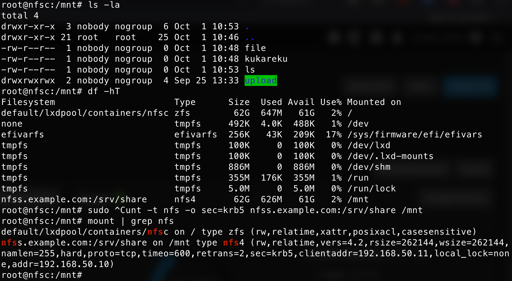

Цель домашнего задания:  
Научиться самостоятельно разворачивать сервис NFS и подключать к нему клиентов.

Описание:  
Основная часть: 
запустить 2 виртуальных машины (сервер NFS и клиента);
на сервере NFS должна быть подготовлена и экспортирована директория; 
в экспортированной директории должна быть поддиректория с именем upload с правами на запись в неё; 
экспортированная директория должна автоматически монтироваться на клиенте при старте виртуальной машины (systemd, autofs или fstab — любым способом);
монтирование и работа NFS на клиенте должна быть организована с использованием NFSv3.
Для самостоятельной реализации: 
настроить аутентификацию через KERBEROS с использованием NFSv4.


```bash
[root@OTUS ~]# lxc list
+--------------+---------+-----------------------+------+-----------+-----------+
|     NAME     |  STATE  |         IPV4          | IPV6 |   TYPE    | SNAPSHOTS |
+--------------+---------+-----------------------+------+-----------+-----------+
| krbrs-server | RUNNING | 192.168.50.175 (eth0) |      | CONTAINER | 0         |
+--------------+---------+-----------------------+------+-----------+-----------+
| nfsc         | RUNNING | 192.168.50.11 (eth0)  |      | CONTAINER | 0         |
+--------------+---------+-----------------------+------+-----------+-----------+
| nfss         | RUNNING | 192.168.50.10 (eth0)  |      | CONTAINER | 0         |
+--------------+---------+-----------------------+------+-----------+-----------+
```

Команды на krbrs-server
```bash
root@krbrs-server:~# cat /etc/os-release
PRETTY_NAME="Ubuntu 24.04.3 LTS"
NAME="Ubuntu"
VERSION_ID="24.04"
VERSION="24.04.3 LTS (Noble Numbat)"
VERSION_CODENAME=noble
ID=ubuntu
ID_LIKE=debian
HOME_URL="https://www.ubuntu.com/"
SUPPORT_URL="https://help.ubuntu.com/"
BUG_REPORT_URL="https://bugs.launchpad.net/ubuntu/"
PRIVACY_POLICY_URL="https://www.ubuntu.com/legal/terms-and-policies/privacy-policy"
UBUNTU_CODENAME=noble
LOGO=ubuntu-logo
root@krbrs-server:~# sudo apt update
root@krbrs-server:~# sudo apt install -y krb5-kdc krb5-admin-server libkrb5-dev
### Проверить timedatectl на синхронизацию времени
### Настроить /etc/hosts, прописать на всех хостах 
root@krbrs-server:~# cat <<EOF >> /etc/hosts
192.168.50.175 krbrs.example.com kdc.example.com krbrs-server.example.com krbrs
192.168.50.10  nfss.example.com nfss
192.168.50.11  nfsc.example.com nfsc
EOF
### Настроить /etc/krb5.conf
root@krbrs-server:~# cat <<EOF > /etc/krb5.conf
[libdefaults]
    default_realm = EXAMPLE.COM
    dns_lookup_realm = false
    dns_lookup_kdc = false

[realms]
    EXAMPLE.COM = {
        kdc = krbrs-server.example.com
        admin_server = krbrs-server.example.com
    }

[domain_realm]
    .example.com = EXAMPLE.COM
    example.com = EXAMPLE.COM
EOF

root@krbrs-server:~# sudo kdb5_util create -s
root@krbrs-server:~# kinit root/admin@EXAMPLE.COM -V

### Не запускался KDC сервер без данного файла
root@krbrs-server:~# echo "#*/admin@STD.LOCAL * \n kdcadmin/admin@STD.LOCAL *" | sudo tee /etc/krb5kdc/kadm5.acl
root@krbrs-server:~# sudo chmod 600 /etc/krb5kdc/kadm5.acl

root@krbrs-server:~# systemctl restart krb5-kdc.service
root@krbrs-server:~# systemctl restart krb5-admin-server.service
root@krbrs-server:~# systemctl enable krb5-kdc.service
root@krbrs-server:~# systemctl enable krb5-admin-server.service

root@krbrs-server:~# sudo kadmin.local
kadmin.local:  addprinc nfs/nfss.example.com@EXAMPLE.COM
No policy specified for nfs/nfss.example.com@EXAMPLE.COM; defaulting to no policy
Enter password for principal "nfs/nfss.example.com@EXAMPLE.COM":
Re-enter password for principal "nfs/nfss.example.com@EXAMPLE.COM":
Principal "nfs/nfss.example.com@EXAMPLE.COM" created.
kadmin.local:  addprinc nfs/nfsc.example.com@EXAMPLE.COM
No policy specified for nfs/nfsc.example.com@EXAMPLE.COM; defaulting to no policy
Enter password for principal "nfs/nfsc.example.com@EXAMPLE.COM":
Re-enter password for principal "nfs/nfsc.example.com@EXAMPLE.COM":
Principal "nfs/nfsc.example.com@EXAMPLE.COM" created.
kadmin.local:  exit

```

Команды на nfss
```bash
root@nfss:~# cat /etc/os-release
PRETTY_NAME="Ubuntu 24.04.3 LTS"
NAME="Ubuntu"
VERSION_ID="24.04"
VERSION="24.04.3 LTS (Noble Numbat)"
VERSION_CODENAME=noble
ID=ubuntu
ID_LIKE=debian
HOME_URL="https://www.ubuntu.com/"
SUPPORT_URL="https://help.ubuntu.com/"
BUG_REPORT_URL="https://bugs.launchpad.net/ubuntu/"
PRIVACY_POLICY_URL="https://www.ubuntu.com/legal/terms-and-policies/privacy-policy"
UBUNTU_CODENAME=noble
LOGO=ubuntu-logo

root@nfss:~# apt update
root@nfss:~# apt install -y nfs-kernel-server krb5-user libkrb5-dev
### Проверить timedatectl на синхронизацию времени
### Настроить /etc/hosts, прописать на всех хостах 
cat <<EOF >> /etc/hosts
192.168.50.175 krbrs.example.com kdc.example.com krbrs-server.example.com krbrs
192.168.50.10  nfss.example.com nfss
192.168.50.11  nfsc.example.com nfsc
EOF
cat <<EOF > /etc/krb5.conf
[libdefaults]
    default_realm = EXAMPLE.COM
    dns_lookup_realm = false
    dns_lookup_kdc = false

[realms]
    EXAMPLE.COM = {
        kdc = krbrs-server.example.com
        admin_server = krbrs-server.example.com
    }

[domain_realm]
    .example.com = EXAMPLE.COM
    example.com = EXAMPLE.COM
EOF
root@nfss:~# kadmin -p root/admin@EXAMPLE.COM -q "ktadd -k /etc/krb5.keytab nfs/nfss.example.com@EXAMPLE.COM"
root@nfss:~# klist -k
Keytab name: FILE:/etc/krb5.keytab
KVNO Principal
---- --------------------------------------------------------------------------
   5 nfs/nfss.example.com@EXAMPLE.COM
   5 nfs/nfss.example.com@EXAMPLE.COM
root@nfss:~# echo "/srv/share  *(rw,no_subtree_check,sec=krb5,root_squash,no_subtree_check)" | tee /etc/exports
root@nfss:~# sed -i 's/^NEED_SVCGSSD=.*/NEED_SVCGSSD="yes"/' /etc/default/nfs-kernel-server
root@nfss:~# systemctl restart nfs-kernel-server.service && exportfs -rsv
exporting *:/srv/share
root@nfss:~# exportfs -v
/srv/share      <world>(sync,wdelay,hide,no_subtree_check,sec=krb5,rw,secure,root_squash,no_all_squash)
root@nfss:~# reboot
```

Команды на nfsc
```bash
root@nfsc:~# cat /etc/os-release
PRETTY_NAME="Ubuntu 24.04.3 LTS"
NAME="Ubuntu"
VERSION_ID="24.04"
VERSION="24.04.3 LTS (Noble Numbat)"
VERSION_CODENAME=noble
ID=ubuntu
ID_LIKE=debian
HOME_URL="https://www.ubuntu.com/"
SUPPORT_URL="https://help.ubuntu.com/"
BUG_REPORT_URL="https://bugs.launchpad.net/ubuntu/"
PRIVACY_POLICY_URL="https://www.ubuntu.com/legal/terms-and-policies/privacy-policy"
UBUNTU_CODENAME=noble
LOGO=ubuntu-logo

root@nfsc:~# sudo apt update
root@nfsc:~# sudo apt install -y nfs-common krb5-user libkrb5-dev
### Проверить timedatectl на синхронизацию времени
### Настроить /etc/hosts, прописать на всех хостах 
root@nfsc:/mnt# cat <<EOF >> /etc/hosts
192.168.50.175 krbrs.example.com kdc.example.com krbrs-server.example.com krbrs
192.168.50.10  nfss.example.com nfss
192.168.50.11  nfsc.example.com nfsc
EOF
root@nfsc:~# cat <<EOF > /etc/krb5.conf
[libdefaults]
    default_realm = EXAMPLE.COM
    dns_lookup_realm = false
    dns_lookup_kdc = false

[realms]
    EXAMPLE.COM = {
        kdc = krbrs-server.example.com
        admin_server = krbrs-server.example.com
    }

[domain_realm]
    .example.com = EXAMPLE.COM
    example.com = EXAMPLE.COM
EOF
root@nfsc:~# sudo kadmin -p root/admin@EXAMPLE.COM -q "ktadd -k /etc/krb5.keytab nfs/nfsc.example.com@EXAMPLE.COM
root@nfsc:~# klist -k
Keytab name: FILE:/etc/krb5.keytab
KVNO Principal
---- --------------------------------------------------------------------------
   2 nfs/nfsc.example.com@EXAMPLE.COM
   2 nfs/nfsc.example.com@EXAMPLE.COM
root@nfss:~# reboot

root@nfss:~# sudo mount -t nfs -o sec=krb5 nfss.example.com:/srv/share /mnt

root@nfsc:/mnt# ls -la
total 4
drwxr-xr-x  3 nobody nogroup  6 Oct  1 10:53 .
drwxr-xr-x 21 root   root    25 Oct  1 10:46 ..
-rw-r--r--  1 nobody nogroup  0 Oct  1 10:48 file
-rw-r--r--  1 nobody nogroup  0 Oct  1 10:48 kukareku
-rw-r--r--  1 nobody nogroup  0 Oct  1 10:53 ls
drwxrwxrwx  2 nobody nogroup  4 Sep 25 13:33 upload
root@nfsc:/mnt# mount | grep nfs
default/lxdpool/containers/nfsc on / type zfs (rw,relatime,xattr,posixacl,casesensitive)
nfss.example.com:/srv/share on /mnt type nfs4 (rw,relatime,vers=4.2,rsize=262144,wsize=262144,namlen=255,hard,proto=tcp,timeo=600,retrans=2,sec=krb5,clientaddr=192.168.50.11,local_lock=none,addr=192.168.50.10)
root@nfsc:/mnt#
root@nfsc:/mnt# df -hT
Filesystem                      Type      Size  Used Avail Use% Mounted on
default/lxdpool/containers/nfsc zfs        62G  647M   61G   2% /
none                            tmpfs     492K  4.0K  488K   1% /dev
efivarfs                        efivarfs  256K   43K  209K  17% /sys/firmware/efi/efivars
tmpfs                           tmpfs     100K     0  100K   0% /dev/lxd
tmpfs                           tmpfs     100K     0  100K   0% /dev/.lxd-mounts
tmpfs                           tmpfs     886M     0  886M   0% /dev/shm
tmpfs                           tmpfs     355M  176K  355M   1% /run
tmpfs                           tmpfs     5.0M     0  5.0M   0% /run/lock
nfss.example.com:/srv/share     nfs4       62G  626M   61G   2% /mnt

```

