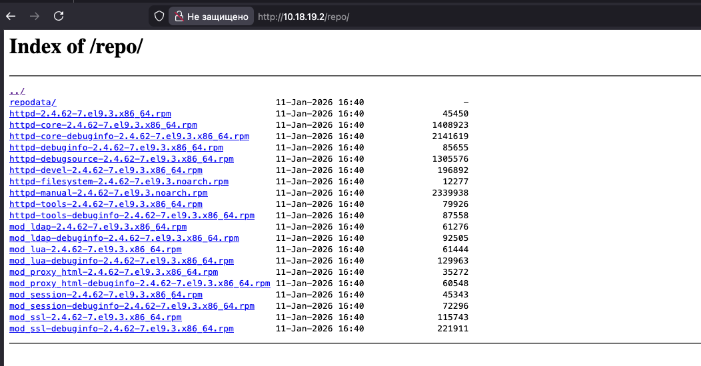

# Домашнее задание: сборка RPM и создание собственного репозитория

## Цель работы

1. Собрать собственный RPM-пакет **Apache HTTPD** из SRPM.
2. Собрать **mod_maxminddb** — Apache-модуль геолокации (GeoIP2/GeoLite2).
3. Создать собственный yum-репозиторий на базе **Nginx** и разместить в нём собранные RPM.
4. Добавить в репозиторий пакет **percona-release** и обеспечить его установку.

Работа выполнена с использованием **Vagrant + Ansible**.

---

## Используемое окружение

- Host OS: macOS / Linux (x86_64)
- Vagrant: **2.4.1**
- VirtualBox: **7.0.x**
- Guest OS: **AlmaLinux 9** (x86_64 / amd64)
- RAM VM: **4 GB**
- CPU: **2 vCPU**

---

## Структура проекта

```text
.
├── Vagrantfile
└── ansible
    ├── ansible.cfg
    ├── hosts.ini
    └── provision.yml
```

---

## Запуск

```bash
vagrant up
```

Репозиторий доступен по адресу: `http://localhost:8080/repo/`

---

## Результат


