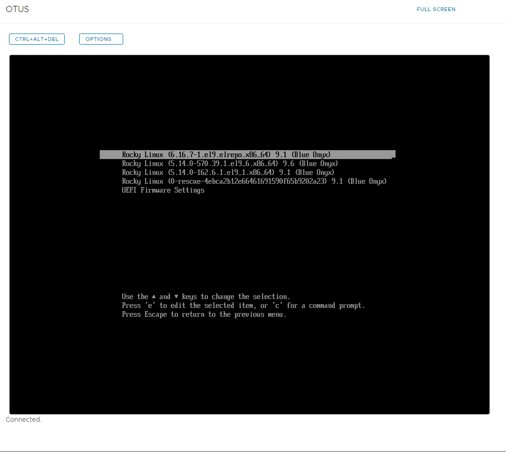
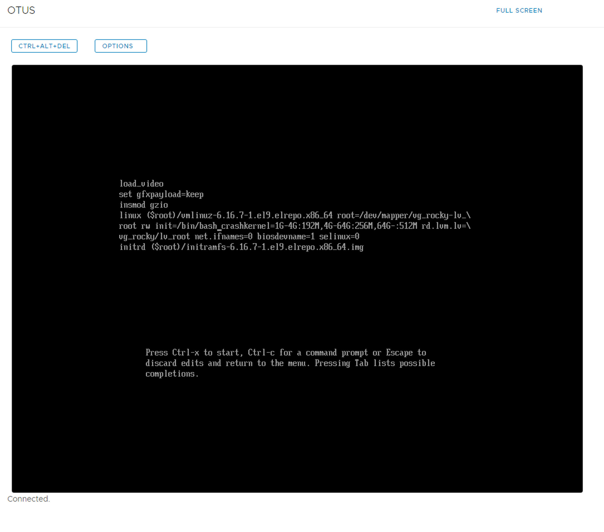
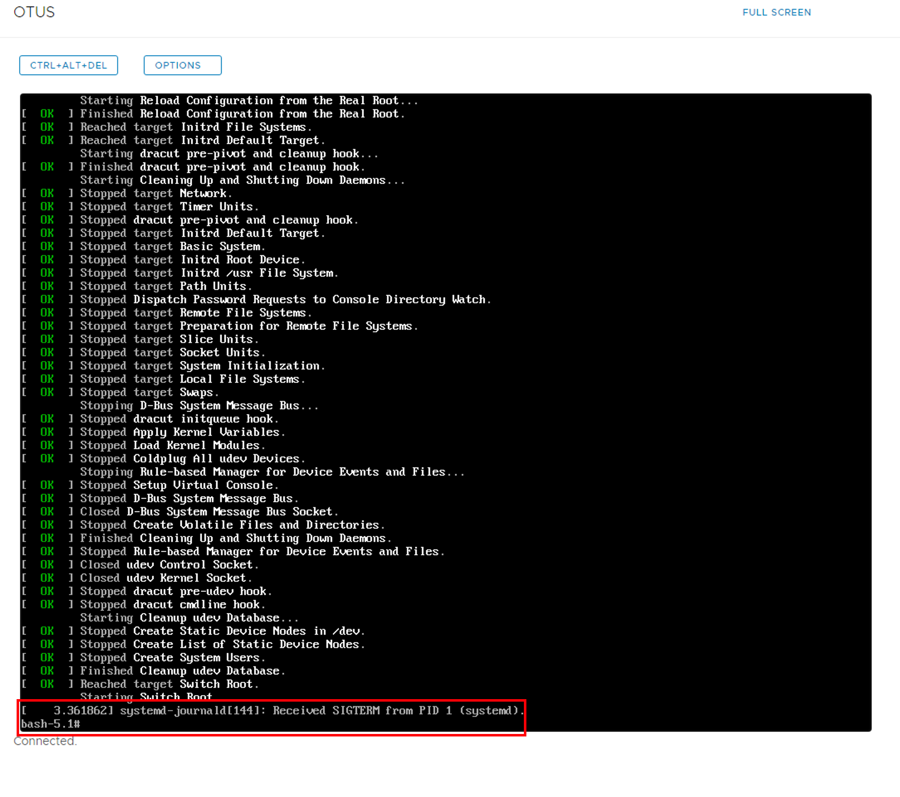
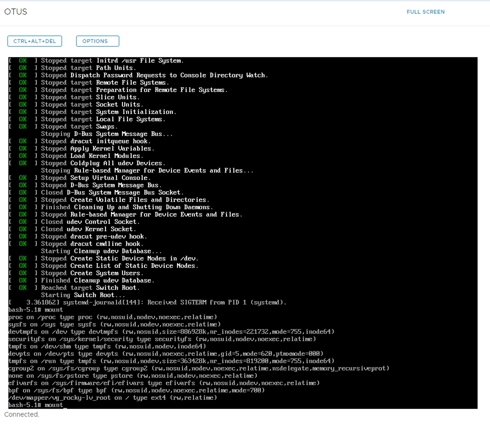
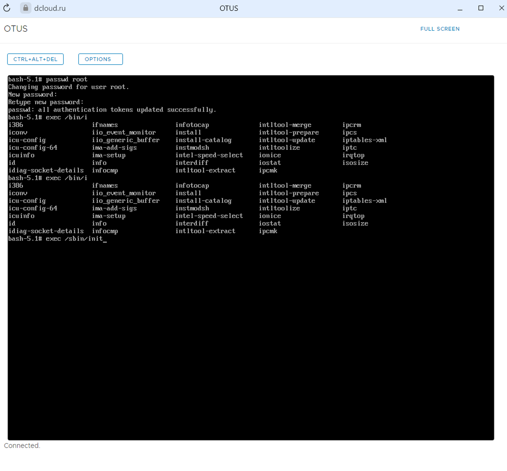

Цель домашнего задания:  
- Включить отображение меню Grub.
- Попасть в систему без пароля несколькими способами.
- Установить систему с LVM, после чего переименовать VG.

```bash
[root@OTUS ~]# vi /etc/default/grub
[root@OTUS ~]# cat /etc/default/grub
GRUB_TIMEOUT=10
GRUB_DISTRIBUTOR="$(sed 's, release .*$,,g' /etc/system-release)"
GRUB_DEFAULT=1
GRUB_DISABLE_SUBMENU=true
GRUB_TERMINAL_OUTPUT="console"
GRUB_CMDLINE_LINUX="crashkernel=1G-4G:192M,4G-64G:256M,64G-:512M rd.lvm.lv=vg_rocky/lv_root net.ifnames=0 biosdevname=1 selinux=0"
GRUB_DISABLE_RECOVERY="true"
GRUB_ENABLE_BLSCFG=true
[root@OTUS ~]#
[root@OTUS ~]# grub2-mkconfig -o /boot/grub2/grub.cfg
Generating grub configuration file ...
Adding boot menu entry for UEFI Firmware Settings ...
done
[root@OTUS ~]#
```







### Задание на переименование VG 

```bash
[root@OTUS ~]# vgs
  VG       #PV #LV #SN Attr   VSize   VFree
  vg_rocky   1   1   0 wz--n- <14.50g <6.50g
[root@OTUS ~]# vgrename vg_rocky vg_root
  Volume group "vg_rocky" successfully renamed to "vg_root"
[root@OTUS ~]# vi /etc/default/grub ### Change vg_rocky to vg_root
[root@OTUS ~]# cat /etc/default/grub
GRUB_TIMEOUT=10
GRUB_DISTRIBUTOR="$(sed 's, release .*$,,g' /etc/system-release)"
GRUB_DEFAULT=1
GRUB_DISABLE_SUBMENU=true
GRUB_TERMINAL_OUTPUT="console"
GRUB_CMDLINE_LINUX="crashkernel=1G-4G:192M,4G-64G:256M,64G-:512M rd.lvm.lv=vg_root/lv_root net.ifnames=0 biosdevname=1 selinux=0"
GRUB_DISABLE_RECOVERY="true"
GRUB_ENABLE_BLSCFG=true
[root@OTUS ~]# vi /etc/fstab ### Change vg_rocky to vg_root
[root@OTUS ~]# cat /etc/fstab

#
# /etc/fstab
# Created by anaconda on Fri Nov 15 00:05:04 2024
#
# Accessible filesystems, by reference, are maintained under '/dev/disk/'.
# See man pages fstab(5), findfs(8), mount(8) and/or blkid(8) for more info.
#
# After editing this file, run 'systemctl daemon-reload' to update systemd
# units generated from this file.
#
/dev/mapper/vg_root-lv_root /                       ext4    defaults,discard 1 1
UUID=1a5d29eb-3af5-4316-97f1-ef6e5dd8d86c /boot                   ext4    defaults        1 2
UUID=0284-2D68          /boot/efi               vfat    defaults,uid=0,gid=0,umask=077,shortname=winnt 0 2
[root@OTUS ~]# reboot

# Перезагружаемся
# Перед загрузкой ОС выбираем первую строку, жмем “e” и правим загрузочную запись, указывая верный Lovical Volume / Volume Group. Жмем ctrl+x для загрузки.

[root@OTUS ~]# grub2-mkconfig -o /boot/grub2/grub.cfg
Generating grub configuration file ...
Adding boot menu entry for UEFI Firmware Settings ...
done

[root@OTUS ~]# lsblk
NAME                MAJ:MIN RM   SIZE RO TYPE MOUNTPOINTS
loop0                 7:0    0  73.9M  1 loop /var/lib/snapd/snap/core22/2133
loop1                 7:1    0 118.3M  1 loop /var/lib/snapd/snap/lxd/35624
loop2                 7:2    0  50.8M  1 loop /var/lib/snapd/snap/snapd/25202
sda                   8:0    0    16G  0 disk
├─sda1                8:1    0   512M  0 part /boot/efi
├─sda2                8:2    0     1G  0 part /boot
└─sda3                8:3    0  14.5G  0 part
  └─vg_root-lv_root 253:0    0     8G  0 lvm  /
sdb                   8:16   0   512M  0 disk
sdc                   8:32   0   512M  0 disk
sdd                   8:48   0   512M  0 disk
sde                   8:64   0   512M  0 disk
sdf                   8:80   0   512M  0 disk
sdg                   8:96   0   512M  0 disk
sdh                   8:112  0   512M  0 disk
sdi                   8:128  0   512M  0 disk
sdj                   8:144  0    64G  0 disk
├─sdj1                8:145  0    64G  0 part
└─sdj9                8:153  0     8M  0 part

```

