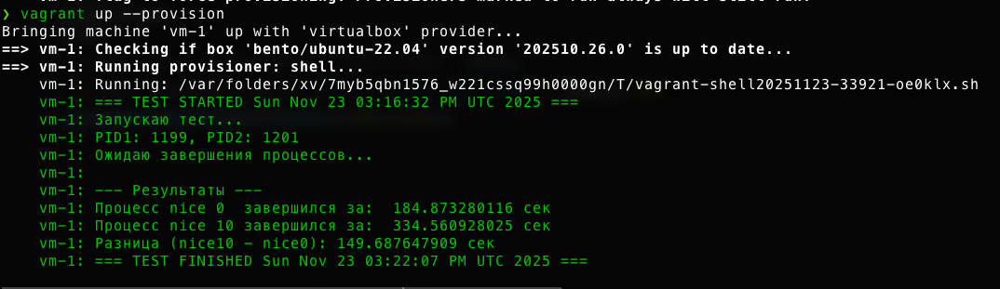

# Домашнее задание: Работа с процессами

## Цель
Научиться работать с процессами, управлять их приоритетами и анализировать влияние приоритетов на выполнение CPU-bound задач.

## Задание
Реализовать 2 конкурирующих процесса по CPU с разными значениями nice и замерить время их выполнения.

## Решение
### [nice_test.sh](./nice_test.sh)

