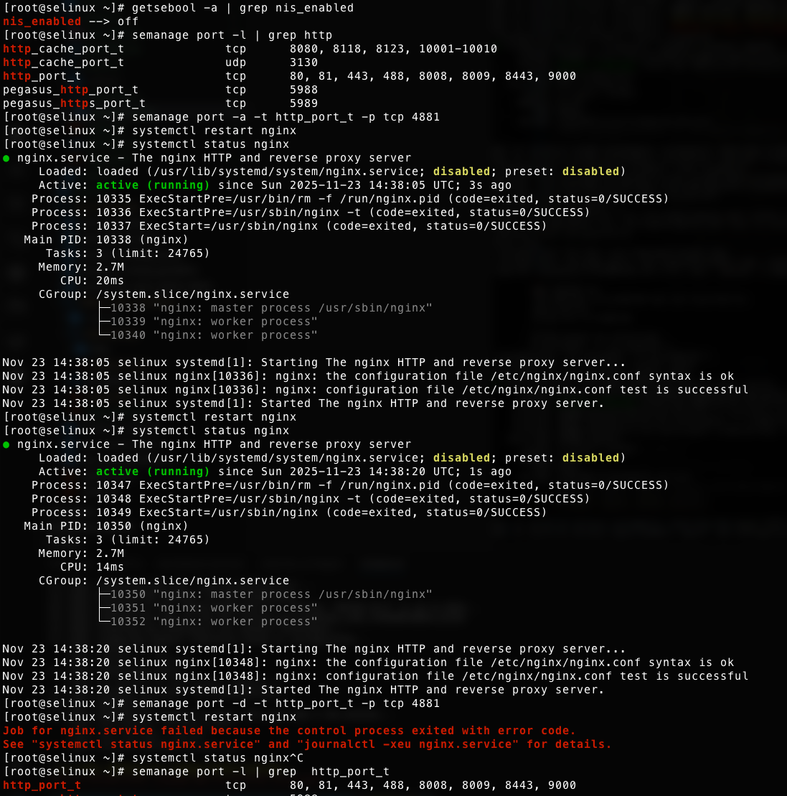
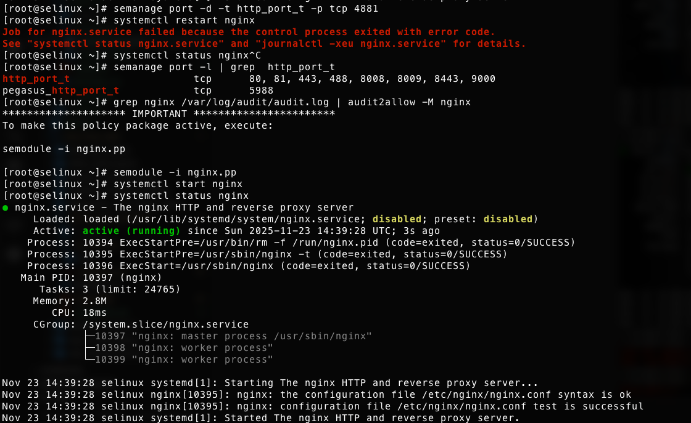
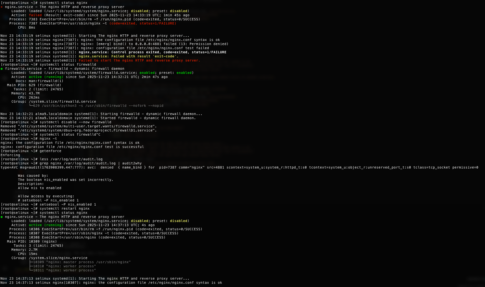

# Домашнее задание: Практика с SELinux

## Цель
Научиться работать с SELinux: диагностировать проблемы и модифицировать политики SELinux для корректной работы приложений.

## Задание
Запустить nginx на нестандартном порту 3-мя разными способами:
1. Переключатели setsebool
2. Добавление нестандартного порта в имеющийся тип  
3. Формирование и установка модуля SELinux

## Формат сдачи
README с описанием каждого решения (скриншоты и демонстрация приветствуются)

## Способы решения

### Способ 1: Использование setsebool
Временное решение с изменением булевых значений SELinux

### Способ 2: Добавление порта в существующий тип
Расширение политики для включения нестандартного порта

### Способ 3: Создание и установка модуля SELinux
Создание кастомного модуля политики для постоянного решения

## Проверка
Убедитесь, что nginx успешно запускается и работает на нестандартном порту после применения каждого из методов.

## Демонстация





Для проверки используйте команды:
```bash
[root@selinux ~]# systemctl status nginx
× nginx.service - The nginx HTTP and reverse proxy server
     Loaded: loaded (/usr/lib/systemd/system/nginx.service; disabled; preset: disabled)
     Active: failed (Result: exit-code) since Sun 2025-11-23 14:33:19 UTC; 1min 45s ago
    Process: 7383 ExecStartPre=/usr/bin/rm -f /run/nginx.pid (code=exited, status=0/SUCCESS)
    Process: 7387 ExecStartPre=/usr/sbin/nginx -t (code=exited, status=1/FAILURE)
        CPU: 8ms

Nov 23 14:33:19 selinux systemd[1]: Starting The nginx HTTP and reverse proxy server...
Nov 23 14:33:19 selinux nginx[7387]: nginx: the configuration file /etc/nginx/nginx.conf syntax is ok
Nov 23 14:33:19 selinux nginx[7387]: nginx: [emerg] bind() to 0.0.0.0:4881 failed (13: Permission denied)
Nov 23 14:33:19 selinux nginx[7387]: nginx: configuration file /etc/nginx/nginx.conf test failed
Nov 23 14:33:19 selinux systemd[1]: nginx.service: Control process exited, code=exited, status=1/FAILURE
Nov 23 14:33:19 selinux systemd[1]: nginx.service: Failed with result 'exit-code'.
Nov 23 14:33:19 selinux systemd[1]: Failed to start The nginx HTTP and reverse proxy server.
[root@selinux ~]# systemctl status firewalld
● firewalld.service - firewalld - dynamic firewall daemon
     Loaded: loaded (/usr/lib/systemd/system/firewalld.service; enabled; preset: enabled)
     Active: active (running) since Sun 2025-11-23 14:32:21 UTC; 2min 47s ago
       Docs: man:firewalld(1)
   Main PID: 629 (firewalld)
      Tasks: 2 (limit: 24765)
     Memory: 43.7M
        CPU: 262ms
     CGroup: /system.slice/firewalld.service
             └─629 /usr/bin/python3 -s /usr/sbin/firewalld --nofork --nopid

Nov 23 14:32:21 alma9.localdomain systemd[1]: Starting firewalld - dynamic firewall daemon...
Nov 23 14:32:21 alma9.localdomain systemd[1]: Started firewalld - dynamic firewall daemon.
[root@selinux ~]# systemctl disable --now firewalld
Removed "/etc/systemd/system/multi-user.target.wants/firewalld.service".
Removed "/etc/systemd/system/dbus-org.fedoraproject.FirewallD1.service".
[root@selinux ~]# nginx -t
nginx: the configuration file /etc/nginx/nginx.conf syntax is ok
nginx: configuration file /etc/nginx/nginx.conf test is successful
[root@selinux ~]# getenforce
Enforcing
[root@selinux ~]# less /var/log/audit/audit.log
[root@selinux ~]# grep nginx /var/log/audit/audit.log | audit2why
type=AVC msg=audit(1763908399.447:777): avc:  denied  { name_bind } for  pid=7387 comm="nginx" src=4881 scontext=system_u:system_r:httpd_t:s0 tcontext=system_u:object_r:unreserved_port_t:s0 tclass=tcp_socket permissive=0

        Was caused by:
        The boolean nis_enabled was set incorrectly.
        Description:
        Allow nis to enabled

        Allow access by executing:
        # setsebool -P nis_enabled 1
[root@selinux ~]# setsebool -P nis_enabled 1
[root@selinux ~]# systemctl restart nginx
[root@selinux ~]# systemctl status nginx
● nginx.service - The nginx HTTP and reverse proxy server
     Loaded: loaded (/usr/lib/systemd/system/nginx.service; disabled; preset: disabled)
     Active: active (running) since Sun 2025-11-23 14:37:13 UTC; 4s ago
    Process: 10306 ExecStartPre=/usr/bin/rm -f /run/nginx.pid (code=exited, status=0/SUCCESS)
    Process: 10307 ExecStartPre=/usr/sbin/nginx -t (code=exited, status=0/SUCCESS)
    Process: 10308 ExecStart=/usr/sbin/nginx (code=exited, status=0/SUCCESS)
   Main PID: 10309 (nginx)
      Tasks: 3 (limit: 24765)
     Memory: 2.7M
        CPU: 15ms
     CGroup: /system.slice/nginx.service
             ├─10309 "nginx: master process /usr/sbin/nginx"
             ├─10310 "nginx: worker process"
             └─10311 "nginx: worker process"

Nov 23 14:37:13 selinux systemd[1]: Starting The nginx HTTP and reverse proxy server...
Nov 23 14:37:13 selinux nginx[10307]: nginx: the configuration file /etc/nginx/nginx.conf syntax is ok
Nov 23 14:37:13 selinux nginx[10307]: nginx: configuration file /etc/nginx/nginx.conf test is successful
Nov 23 14:37:13 selinux systemd[1]: Started The nginx HTTP and reverse proxy server.
[root@selinux ~]# getsebool -a | grep nis_enabled
nis_enabled --> on
[root@selinux ~]# setsebool -P nis_enabled off
[root@selinux ~]# getsebool -a | grep nis_enabled
nis_enabled --> off
[root@selinux ~]# semanage port -l | grep http
http_cache_port_t              tcp      8080, 8118, 8123, 10001-10010
http_cache_port_t              udp      3130
http_port_t                    tcp      80, 81, 443, 488, 8008, 8009, 8443, 9000
pegasus_http_port_t            tcp      5988
pegasus_https_port_t           tcp      5989
[root@selinux ~]# semanage port -a -t http_port_t -p tcp 4881
[root@selinux ~]# systemctl restart nginx
[root@selinux ~]# systemctl status nginx
● nginx.service - The nginx HTTP and reverse proxy server
     Loaded: loaded (/usr/lib/systemd/system/nginx.service; disabled; preset: disabled)
     Active: active (running) since Sun 2025-11-23 14:38:05 UTC; 3s ago
    Process: 10335 ExecStartPre=/usr/bin/rm -f /run/nginx.pid (code=exited, status=0/SUCCESS)
    Process: 10336 ExecStartPre=/usr/sbin/nginx -t (code=exited, status=0/SUCCESS)
    Process: 10337 ExecStart=/usr/sbin/nginx (code=exited, status=0/SUCCESS)
   Main PID: 10338 (nginx)
      Tasks: 3 (limit: 24765)
     Memory: 2.7M
        CPU: 20ms
     CGroup: /system.slice/nginx.service
             ├─10338 "nginx: master process /usr/sbin/nginx"
             ├─10339 "nginx: worker process"
             └─10340 "nginx: worker process"

Nov 23 14:38:05 selinux systemd[1]: Starting The nginx HTTP and reverse proxy server...
Nov 23 14:38:05 selinux nginx[10336]: nginx: the configuration file /etc/nginx/nginx.conf syntax is ok
Nov 23 14:38:05 selinux nginx[10336]: nginx: configuration file /etc/nginx/nginx.conf test is successful
Nov 23 14:38:05 selinux systemd[1]: Started The nginx HTTP and reverse proxy server.
[root@selinux ~]# systemctl restart nginx
[root@selinux ~]# systemctl status nginx
● nginx.service - The nginx HTTP and reverse proxy server
     Loaded: loaded (/usr/lib/systemd/system/nginx.service; disabled; preset: disabled)
     Active: active (running) since Sun 2025-11-23 14:38:20 UTC; 1s ago
    Process: 10347 ExecStartPre=/usr/bin/rm -f /run/nginx.pid (code=exited, status=0/SUCCESS)
    Process: 10348 ExecStartPre=/usr/sbin/nginx -t (code=exited, status=0/SUCCESS)
    Process: 10349 ExecStart=/usr/sbin/nginx (code=exited, status=0/SUCCESS)
   Main PID: 10350 (nginx)
      Tasks: 3 (limit: 24765)
     Memory: 2.7M
        CPU: 14ms
     CGroup: /system.slice/nginx.service
             ├─10350 "nginx: master process /usr/sbin/nginx"
             ├─10351 "nginx: worker process"
             └─10352 "nginx: worker process"

Nov 23 14:38:20 selinux systemd[1]: Starting The nginx HTTP and reverse proxy server...
Nov 23 14:38:20 selinux nginx[10348]: nginx: the configuration file /etc/nginx/nginx.conf syntax is ok
Nov 23 14:38:20 selinux nginx[10348]: nginx: configuration file /etc/nginx/nginx.conf test is successful
Nov 23 14:38:20 selinux systemd[1]: Started The nginx HTTP and reverse proxy server.
[root@selinux ~]# semanage port -d -t http_port_t -p tcp 4881
[root@selinux ~]# systemctl restart nginx
Job for nginx.service failed because the control process exited with error code.
See "systemctl status nginx.service" and "journalctl -xeu nginx.service" for details.
[root@selinux ~]# systemctl status nginx^C
[root@selinux ~]# semanage port -l | grep  http_port_t
http_port_t                    tcp      80, 81, 443, 488, 8008, 8009, 8443, 9000
pegasus_http_port_t            tcp      5988
[root@selinux ~]# grep nginx /var/log/audit/audit.log | audit2allow -M nginx
******************** IMPORTANT ***********************
To make this policy package active, execute:

semodule -i nginx.pp

[root@selinux ~]# semodule -i nginx.pp
[root@selinux ~]# systemctl start nginx
[root@selinux ~]# systemctl status nginx
● nginx.service - The nginx HTTP and reverse proxy server
     Loaded: loaded (/usr/lib/systemd/system/nginx.service; disabled; preset: disabled)
     Active: active (running) since Sun 2025-11-23 14:39:28 UTC; 3s ago
    Process: 10394 ExecStartPre=/usr/bin/rm -f /run/nginx.pid (code=exited, status=0/SUCCESS)
    Process: 10395 ExecStartPre=/usr/sbin/nginx -t (code=exited, status=0/SUCCESS)
    Process: 10396 ExecStart=/usr/sbin/nginx (code=exited, status=0/SUCCESS)
   Main PID: 10397 (nginx)
      Tasks: 3 (limit: 24765)
     Memory: 2.8M
        CPU: 18ms
     CGroup: /system.slice/nginx.service
             ├─10397 "nginx: master process /usr/sbin/nginx"
             ├─10398 "nginx: worker process"
             └─10399 "nginx: worker process"

Nov 23 14:39:28 selinux systemd[1]: Starting The nginx HTTP and reverse proxy server...
Nov 23 14:39:28 selinux nginx[10395]: nginx: the configuration file /etc/nginx/nginx.conf syntax is ok
Nov 23 14:39:28 selinux nginx[10395]: nginx: configuration file /etc/nginx/nginx.conf test is successful
Nov 23 14:39:28 selinux systemd[1]: Started The nginx HTTP and reverse proxy server.
[root@selinux ~]# semodule -r nginx
libsemanage.semanage_direct_remove_key: Removing last nginx module (no other nginx module exists at another priority).
[root@selinux ~]# systemctl status nginx
● nginx.service - The nginx HTTP and reverse proxy server
     Loaded: loaded (/usr/lib/systemd/system/nginx.service; disabled; preset: disabled)
     Active: active (running) since Sun 2025-11-23 14:39:28 UTC; 2min 31s ago
    Process: 10394 ExecStartPre=/usr/bin/rm -f /run/nginx.pid (code=exited, status=0/SUCCESS)
    Process: 10395 ExecStartPre=/usr/sbin/nginx -t (code=exited, status=0/SUCCESS)
    Process: 10396 ExecStart=/usr/sbin/nginx (code=exited, status=0/SUCCESS)
   Main PID: 10397 (nginx)
      Tasks: 3 (limit: 24765)
     Memory: 2.8M
        CPU: 18ms
     CGroup: /system.slice/nginx.service
             ├─10397 "nginx: master process /usr/sbin/nginx"
             ├─10398 "nginx: worker process"
             └─10399 "nginx: worker process"

Nov 23 14:39:28 selinux systemd[1]: Starting The nginx HTTP and reverse proxy server...
Nov 23 14:39:28 selinux nginx[10395]: nginx: the configuration file /etc/nginx/nginx.conf syntax is ok
Nov 23 14:39:28 selinux nginx[10395]: nginx: configuration file /etc/nginx/nginx.conf test is successful
Nov 23 14:39:28 selinux systemd[1]: Started The nginx HTTP and reverse proxy server.
[root@selinux ~]# systemctl restart nginx
Job for nginx.service failed because the control process exited with error code.
See "systemctl status nginx.service" and "journalctl -xeu nginx.service" for details.
```
