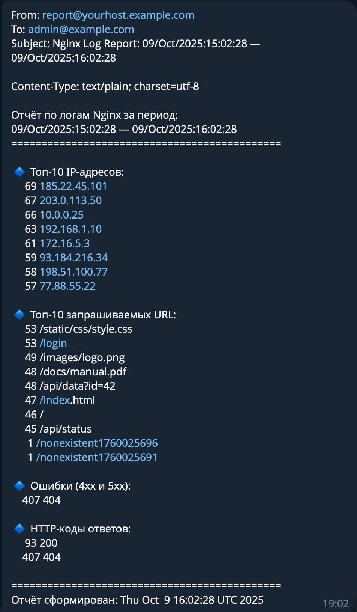

Цель домашнего задания:  
- написать bash-скрипт, который ежечасно формирует и отправляет на email отчёт о работе веб-сервера;

Отчёт должен содержать:
- IP-адреса с наибольшим числом запросов (с момента последнего запуска);
- Запрашиваемые URL с наибольшим числом запросов (с момента последнего запуска);
- Ошибки веб-сервера/приложения (с момента последнего запуска);
- HTTP-коды ответов с указанием их количества (с момента последнего запуска).

```bash
### Настроен crontab на ежечасное исполнение скрипта
root@krbrs-server:~# crontab -l
0 * * * * /usr/local/bin/analyze_logs.sh

### Настроен инстанс nginx-first для переназначения real_ip_header на тот что передаем в заголовке в скрипте
root@krbrs-server:~# cat /etc/nginx/nginx-first.conf
user www-data;
worker_processes auto;
pid /run/nginx-first.pid;
error_log /var/log/nginx/first-error.log;
include /etc/nginx/modules-enabled/*.conf;

events {
        worker_connections 768;
        # multi_accept on;
}

http {
    real_ip_header X-Forwarded-For;
    set_real_ip_from 127.0.0.1;
    set_real_ip_from ::1;
    real_ip_recursive on;
        server {
                listen 8081 default_server;
                listen [::]:8081 default_server;
        ...
        }
    ...
}

### Скрипты для исполнения предоставлены в файлах
analyze_logs.sh

```

[Скрипт анализа логов](./analyze_logs.sh)

[Скрипт генерации логов](./generate_logs.sh)

### Результат формирования отчета предоставлен на скриншоте
