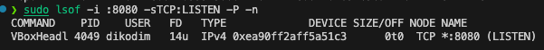
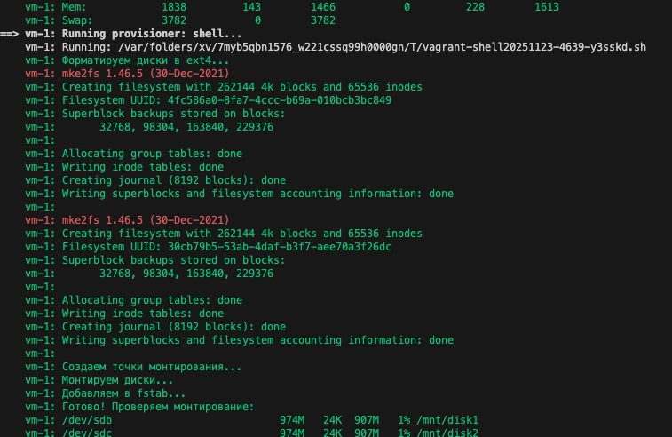

# Vagrant: Знакомство
# 🎯 Задание: Настройка виртуальной машины с дополнительными дисками

## Описание проекта
Проект демонстрирует автоматизацию настройки виртуальной машины с дополнительными дисками с использованием Vagrant и провижининга.

## 🛠️ Файлы проекта

### [Vagrantfile](./Vagrantfile)
Конфигурационный файл Vagrant, который:
- 🖥️ Создает виртуальную машину на базе Ubuntu
- 💾 Настраивает ресурсы (1024 МБ памяти)
- 🗂️ Добавляет 2 дополнительных диска по 1 ГБ каждый
- 🔄 Настраивает проброс портов (80 → 8080)
- ⚙️ Запускает скрипт провижининга

### [setup-disks.sh](./setup-disks.sh)
Скрипт провижининга, который:
- 💽 Форматирует добавленные диски в файловую систему ext4
- 📁 Создает точки монтирования `/mnt/disk1` и `/mnt/disk2`
- 🔗 Монтирует диски в указанные директории
- 📝 Добавляет записи в `/etc/fstab` для автоматического монтирования при загрузке

## 📸 Результаты работы

### Настройка проброса портов

*Демонстрация работы проброса порта 80 гостевой системы на порт 8080 хостовой системы*

### Настройка дисков

*Результат работы провижининга: отформатированные диски, точки монтирования и записи в fstab*


## Требования
- VirtualBox
- Vagrant

## Запуск проекта
1. Клонируйте репозиторий
2. Перейдите в директорию проекта
3. Выполните команду:
   ```bash
   vagrant up
   ```
