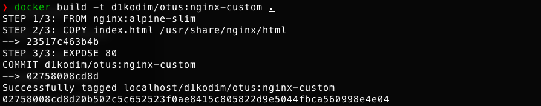
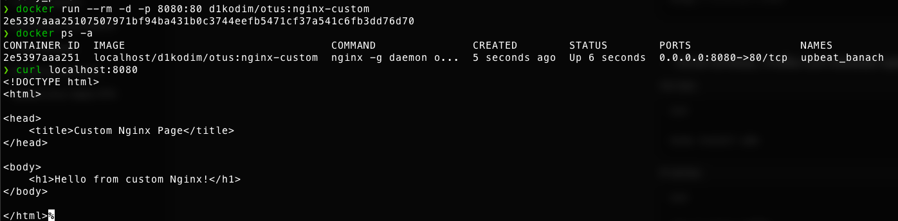
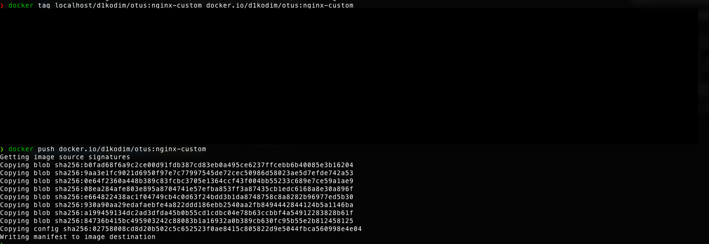

# 🐳 Домашнее задание: Docker

## 🎯 Цель
Освоить базовые принципы работы с Docker, научиться создавать, настраивать и управлять контейнерами.

## 📋 Задачи

### 1. Установка Docker
- Установите Docker на хост-машину по [официальной инструкции](https://docs.docker.com/engine/install/ubuntu/)

### 2. Установка Docker Compose
- Установите Docker Compose как плагин или как отдельное приложение

### 3. Создание кастомного образа Nginx
- Создайте свой кастомный образ nginx на базе alpine
- После запуска nginx должен отдавать кастомную страницу (достаточно изменить дефолтную страницу nginx)

### 4. Сравнение контейнера и образа
- Определите разницу между контейнером и образом
- Вывод опишите в домашнем задании

### 5. Ответ на вопрос
- Ответьте на вопрос: Можно ли в контейнере собрать ядро?

### Dockerfile
Файл для создания кастомного образа Nginx:
- 🐳 Базовый образ: nginx:alpine
- 📄 Копирует кастомную конфигурацию nginx
- 🌐 Копирует кастомную HTML-страницу
- 🔧 Настраивает необходимые параметры

### index.html
Кастомная веб-страница:
- 🎨 Уникальное содержимое

## 🚀 Запуск проекта
```bash
docker pull d1kodim/otus:nginx-custom

### Сборка образа
```bash
docker build -t d1kodim/otus:nginx-custom .
docker tag localhost/d1kodim/otus:nginx-custom docker.io/d1kodim/otus:nginx-custom
```

### В чем разница между контейнером и образом?
- Образ является шаблоном для запуска контейнера. В обазе имеются слои и предустановки.
Контейнер же, это процесс запущенный средствами контейнеризации хостовой ВМ из образа.

### Можно ли в контейнере собрать ядро?
- Скомпилировать ядро в контейнере возможно.




