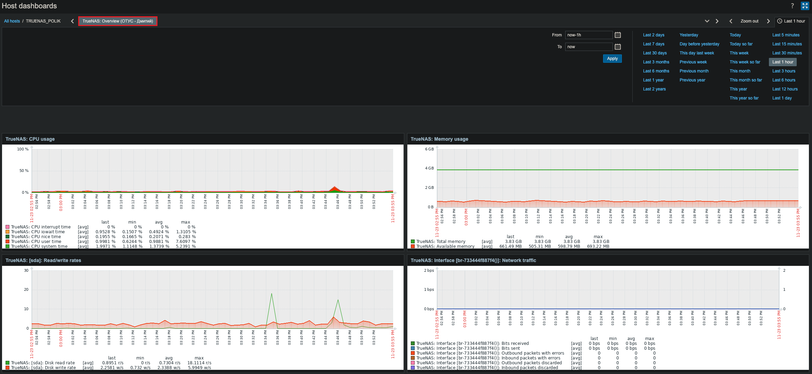
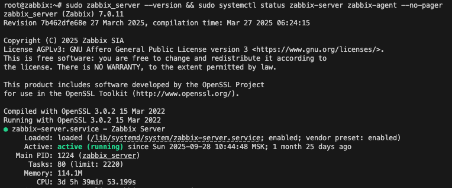

# Домашнее задание: Настройка мониторинга

## Цель
Научиться настраивать дашборд для мониторинга системных метрик.

## Задание
Настроить дашборд с 4-мя графиками:
- Память
- Процессор  
- Диск
- Сеть

## Варианты реализации
Выберите одну из систем для настройки:
- **Zabbix** (использовать screen - комплексный экран)
- **Prometheus + Grafana**

## Требования к сдаче
- Скриншот дашборда
- В названии дашборда должно быть ваше имя

