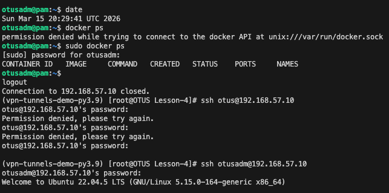

# Домашнее задание: Vagrant-стенд c PAM

## Цель работы

Научиться создавать пользователей и добавлять им ограничения.

## Описание задания

1. Ограничить доступ к системе для всех пользователей, кроме группы **admin**, в выходные дни (суббота и воскресенье).
2. ⭐ Предоставить пользователю **dockeruser** доступ к Docker и право перезапускать Docker-сервис.

Работа выполнена с использованием **Vagrant + Ansible**.

---

## Используемое окружение

- Host OS: macOS / Linux (x86_64)
- Vagrant: **2.4.1**
- VirtualBox: **7.0.x**
- Guest OS: **Ubuntu 22.04 LTS (Jammy)**
- RAM VM: **1 GB**
- CPU: **2 vCPU**

---

## Структура проекта

```text
.
├── Vagrantfile
└── ansible
    ├── ansible.cfg
    ├── hosts.ini
    └── provision.yml
```

---

## Запуск

```bash
vagrant up
```

---

## Реализация

### 1. Пользователи и группы

Создаются два пользователя:

| Пользователь | Группа admin | Пароль     |
|--------------|:------------:|------------|
| otus         | нет          | Otus2022!  |
| otusadm      | да           | Otus2022!  |
| vagrant      | да           | —          |
| root         | да           | —          |

```bash
sudo useradd otus && sudo useradd otusadm
echo "Otus2022!" | sudo passwd --stdin otusadm
echo "Otus2022!" | sudo passwd --stdin otus
sudo groupadd -f admin
sudo usermod otusadm -a -G admin
sudo usermod root    -a -G admin
sudo usermod vagrant -a -G admin
```

Проверить состав группы:

```bash
$ cat /etc/group | grep admin
admin:x:1003:otusadm,root,vagrant
```

### 2. PAM — ограничение по времени

Используется модуль `pam_exec` со скриптом `/usr/local/bin/login.sh`.

**Скрипт** (`/usr/local/bin/login.sh`):

```bash
#!/bin/bash
if [ $(date +%a) = "Sat" ] || [ $(date +%a) = "Sun" ]; then
  if getent group admin | grep -qw "$PAM_USER"; then
    exit 0
  else
    exit 1
  fi
else
  exit 0
fi
```

Логика: если сегодня суббота или воскресенье — пропускаем только пользователей группы `admin`. В будние дни доступ разрешён всем.

**Подключение в `/etc/pam.d/sshd`** (после `@include common-auth`):

```
auth required pam_exec.so debug /usr/local/bin/login.sh
```

**Проверка** (симуляция выходного дня):

```bash
# На ВМ установить субботу:
sudo date -s "2025-08-30 12:00:00"

# Подключение должно быть запрещено:
ssh otus@192.168.57.10       # → Permission denied

# Подключение должно быть разрешено:
ssh otusadm@192.168.57.10    # → успешно
```

### 3. ⭐ Пользователь dockeruser

Пользователь `dockeruser` добавлен в группу `docker` (доступ к Docker socket) и получает право перезапускать сервис без пароля через sudoers:

```
dockeruser ALL=(ALL) NOPASSWD: /bin/systemctl restart docker
```

**Проверка**:

```bash
ssh dockeruser@192.168.57.10
docker ps                          # работает без sudo
sudo systemctl restart docker      # работает без пароля
```

---

## Результат


