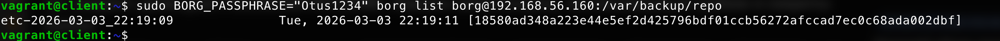
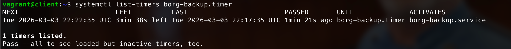
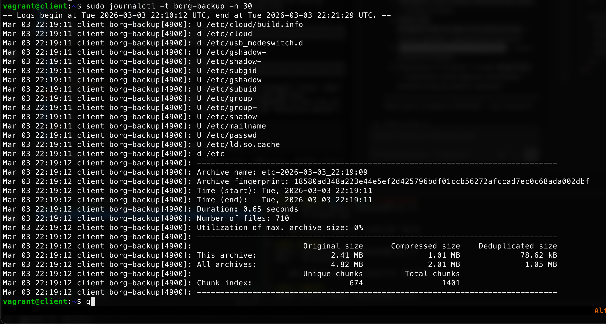

# Домашнее задание: Резервное копирование (BorgBackup)

## Цель
Научиться настраивать резервное копирование с помощью утилиты BorgBackup.

---

## Текст задания

Настроить стенд Vagrant с двумя виртуальными машинами: `backup_server` и `client`.

Настроить удалённый бэкап каталога `/etc` с сервера `client` при помощи `borgbackup`:

- Директория для резервных копий `/var/backup` — отдельная точка монтирования (~2 GB диск);
- Репозиторий зашифрован паролём (`repokey`);
- Имя бэкапа содержит временну́ю метку: `etc-YYYY-MM-DD_HH:MM:SS`;
- Глубина хранения: ежедневные за 90 дней, ежемесячные за 12 месяцев, ежегодные за 1 год;
- Резервная копия снимается каждые **5 минут** (для демонстрации);
- Автоматизация через **systemd timer**;
- Логирование через `journald` с тегом `borg-backup`.

---

## Схема сети

```
+-------------------+          private network          +-------------------+
|      client       |  192.168.56.150 <-> 192.168.56.160|   backup_server   |
|  Ubuntu 22.04     | ---------------------------------- |  Ubuntu 22.04     |
|  /etc  (source)   |      borg over SSH                 |  /var/backup      |
+-------------------+                                   | (отд. диск 2 GB)  |
                                                        +-------------------+
```

---

## Структура проекта

```
.
├── Vagrantfile
├── README.md
├── Screenshots/
└── ansible/
    ├── ansible.cfg
    ├── hosts
    ├── provision.yml
    └── templates/
        ├── borg-backup.service.j2
        └── borg-backup.timer.j2
```

---

## Особенности реализации

- **Шифрование**: `repokey` — ключ хранится в репозитории, защищён паролем `BORG_PASSPHRASE`.
- **Дополнительный диск**: к VM `backup` подключается диск (~2 GB) через `vm.disk`, монтируется в `/var/backup`; репозиторий создаётся в `/var/backup/repo`.
- **SSH-аутентификация**: Ansible генерирует ключ на `client`, публичная часть добавляется в `~borg/.ssh/authorized_keys` на `backup`.
- **Порядок провизии**: сначала настраивается `backup`, затем генерируются ключи на `client`, потом ключ регистрируется на `backup`, и в конце инициализируется репозиторий и разворачиваются systemd-юниты на `client`.
- **Политика prune**: `--keep-daily 90 --keep-monthly 12 --keep-yearly 1` — последние 3 месяца ежедневно, далее по одной на конец месяца, итого год.
- **Логирование**: `StandardOutput=journal`, `SyslogIdentifier=borg-backup` — смотреть через `journalctl -t borg-backup`.

---

## Проверка

```bash
# Список бэкапов
sudo BORG_PASSPHRASE="Otus1234" borg list borg@192.168.56.160:/var/backup/repo

# Запустить бэкап вручную
sudo systemctl start borg-backup.service

# Статус таймера
systemctl list-timers borg-backup.timer

# Логи
sudo journalctl -t borg-backup -n 50
```

## Результаты

### Список архивов в репозитории

Архив создан с именем `etc-2026-03-03_22:19:09` — временна́я метка в имени подтверждает корректную работу:



### Статус systemd-таймера

Таймер активен, следующий запуск через ~5 минут:



### Логи бэкапа (journalctl)

Borg перебрал все файлы `/etc`, создал архив размером 2.41 MB (сжато до 1.01 MB, дедуплицировано до 78.62 kB):


