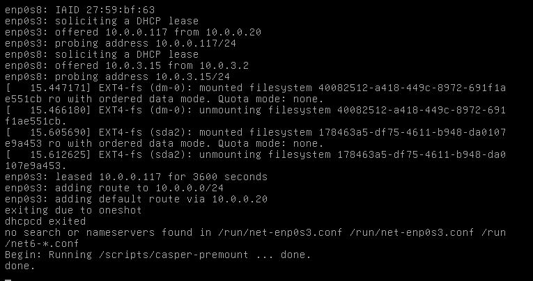

# Домашнее задание: Vagrant-стенд c PXE

## Цель работы

Отработать навыки установки и настройки DHCP, TFTP, PXE загрузчика и автоматической загрузки.

## Описание задания

1. Настроить загрузку по сети дистрибутива Ubuntu 24.
2. Установка проходит из HTTP-репозитория (Apache2).
3. Настроить автоматическую установку c помощью файла `user-data`.
4. ⭐ Поддержка UEFI-загрузки (bootx64.efi + grubx64.efi).

Работа выполнена с использованием **Vagrant + Ansible**.

---

## Используемое окружение

- Host OS: macOS / Linux (x86_64)
- Vagrant: **2.4.1**
- VirtualBox: **7.0.x**
- pxeserver: **Ubuntu 22.04** (bento/ubuntu-22.04), 1 GB RAM
- pxeclient: **Ubuntu 22.04** (bento/ubuntu-22.04), 4 GB RAM (загрузка по PXE)

---

## Структура проекта

```text
.
├── Vagrantfile
└── ansible
    ├── ansible.cfg
    ├── provision.yml
    └── templates
        ├── ks-server.conf.j2        # Apache2 virtual host
        ├── pxe.conf.j2              # dnsmasq DHCP+TFTP
        ├── pxelinux.cfg.default.j2  # PXE boot menu
        └── user-data.j2             # cloud-init autoinstall
```

---

## Схема сети

```
Host ──────── pxeserver ──────── pxeclient
               eth0: NAT          nic1: intnet (pxenet) → загрузка по PXE
               eth1: 10.0.0.20   nic2: NAT (для интернета после установки)
               eth2: 192.168.50.10 (Ansible SSH)
```

---

## Запуск

```bash
vagrant up
```

> **Важно:** Команда завершится с таймаутом на `pxeclient` — это ожидаемое поведение, так как клиент пытается загрузиться по PXE и ожидает сервер. Сам `pxeserver` поднимается и настраивается корректно.

---

## Компоненты

### DHCP + TFTP — dnsmasq

Конфиг `/etc/dnsmasq.d/pxe.conf`:

```ini
interface=eth1
bind-interfaces
dhcp-range=eth1,10.0.0.100,10.0.0.120
dhcp-boot=pxelinux.0
# UEFI
dhcp-match=set:efi-x86_64,option:client-arch,7
dhcp-boot=tag:efi-x86_64,bootx64.efi
enable-tftp
tftp-root=/srv/tftp/amd64
```

### TFTP-файлы

Скачиваются из `noble-netboot-amd64.tar.gz` и распаковываются в `/srv/tftp`:

```
/srv/tftp/amd64/
├── bootx64.efi
├── grub/grub.cfg
├── grubx64.efi
├── initrd
├── ldlinux.c32
├── linux
├── pxelinux.0
└── pxelinux.cfg/default
```

### Web-сервер — Apache2

ISO-образ Ubuntu 24.04 (~2.6 GB) раздаётся по HTTP с `10.0.0.20`.

VirtualHost `/etc/apache2/sites-available/ks-server.conf` открывает каталоги:
- `/srv/images` — ISO-образ
- `/srv/ks` — файлы автоустановки

### PXE boot menu

`/srv/tftp/amd64/pxelinux.cfg/default`:

```
DEFAULT install
LABEL install
  KERNEL linux
  INITRD initrd
  APPEND root=/dev/ram0 ramdisk_size=3000000 ip=dhcp \
    iso-url=http://10.0.0.20/srv/images/noble-live-server-amd64.iso \
    autoinstall ds=nocloud-net;s=http://10.0.0.20/srv/ks/
```

### Автоматическая установка — user-data

`/srv/ks/user-data` содержит cloud-init autoinstall конфигурацию:

- Репозиторий: `http://us.archive.ubuntu.com/ubuntu`
- Hostname: `linux`
- Пользователь: `otus`, пароль: `123` (SHA-512)
- SSH: разрешён доступ по паролю
- Сеть: DHCP на обоих интерфейсах

---

## Проверка

После `vagrant up` (когда pxeserver поднят):

```bash
# Зайти на pxeserver
vagrant ssh pxeserver

# Проверить dnsmasq
sudo systemctl status dnsmasq

# Проверить TFTP-файлы
ls /srv/tftp/amd64/

# Проверить ISO
ls -lh /srv/images/

# Проверить web-сервер
curl http://10.0.0.20/srv/ks/user-data
```

Для запуска клиента вручную через VirtualBox: открыть GUI и запустить ВМ `pxeclient`.

---

## Результат


