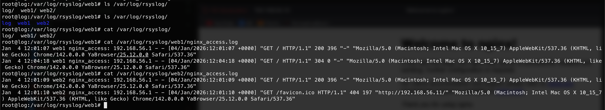

# Домашнее задание: Централизованный сбор логов с Vagrant

## Цель
Научиться проектировать централизованный сбор логов. Рассмотреть особенности разных платформ для сбора логов.

---

## Задание
1. Развернуть в Vagrant две виртуальные машины: `web` и `log`.  
2. На `web` настроить Nginx.  
3. На `log` настроить центральный лог-сервер на любой системе на выбор:  
   - `journald`  
   - `rsyslog`  
   - `ELK`  
4. Настроить аудит, следящий за изменением конфигураций Nginx.  

**Требования к логам:**
- Все критичные логи с `web` должны собираться **локально и на удаленный сервер**.  
- Все логи Nginx должны уходить на удаленный сервер (локально только критичные).  
- Логи аудита должны также уходить на удаленную систему.

---

## Формат сдачи
- Vagrant + Ansible  
- README.md с описанием конфигурации, команд и проверок  

---

## Vagrantfile
[Ссылка на Vagrantfile](./Vagrantfile)

## Andisble-playbook
[Ссылка на ansible playbook](./ansible/main.yml)

