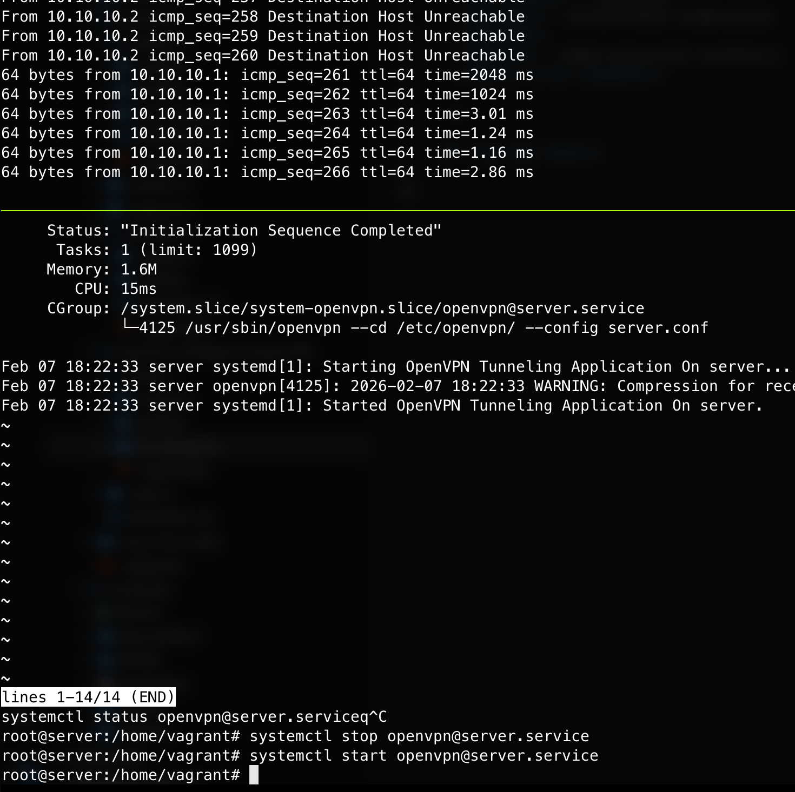
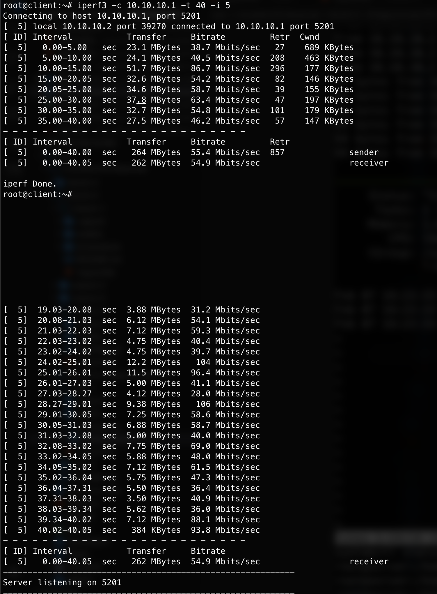
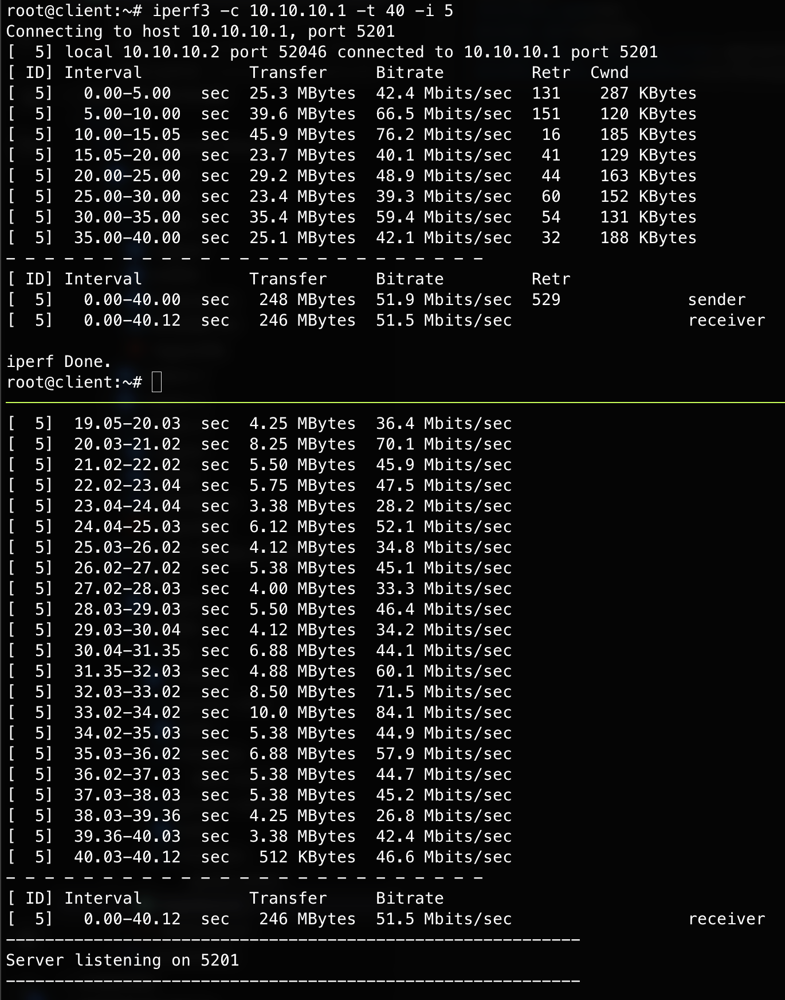
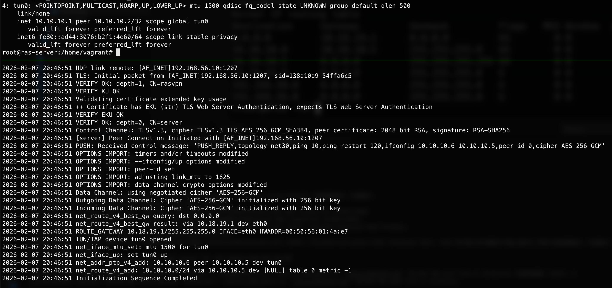
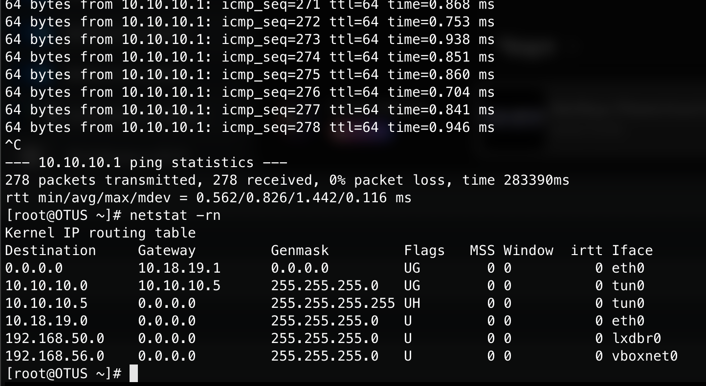

# OpenVPN: туннели и RAS (Vagrant + Ansible)

## Цель работы

1. Изучить принципы работы VPN-туннелей OpenVPN в режимах **TAP** и **TUN**.
2. Выполнить настройку site-to-site VPN с использованием **static key**.
3. Выполнить настройку **RAS (Remote Access Server)** на базе OpenVPN с PKI.
4. Автоматизировать развёртывание инфраструктуры с помощью **Vagrant** и **Ansible**.
5. Сравнить производительность и особенности режимов TAP и TUN.

---

## Используемые технологии

- **Vagrant** — развёртывание виртуальных машин
- **VirtualBox** — гипервизор
- **Ansible** — автоматизация конфигурации
- **OpenVPN**
- **iperf3** — замер пропускной способности
- **Ubuntu 22.04 (jammy64)**

---
## Ход работы

### 1. Развёртывание инфраструктуры

С помощью **Vagrant** были развёрнуты виртуальные машины под управлением Ubuntu 22.04.  
Provisioning выполнялся с использованием **Ansible**, который автоматически устанавливал и настраивал OpenVPN.

---

### 2. Site-to-Site VPN (Static Key)

- Использован режим **TUN**
- Аутентификация выполнена с помощью **static key**
- VPN-туннель успешно установлен между двумя узлами
- Проверка соединения выполнена с помощью `ping` и `iperf3`

**Результат:**  
Узлы успешно обмениваются трафиком через VPN-туннель.

## Скриншоты

### Проверка работоспособности VPN


### Тест производительности в режиме TAP


### Тест производительности в режиме TUN


---

### 3. RAS (Remote Access Server) на базе OpenVPN

На сервере OpenVPN выполнено:

- Установка `openvpn` и `easy-rsa`
- Инициализация **PKI**
- Генерация сертификатов:
  - CA
  - Серверного сертификата
  - Клиентского сертификата
- Настройка файла `server.conf`
- Настройка `client-config-dir` и параметра `iroute`
- Запуск сервиса `openvpn@server`

На клиентской машине:

- Создан файл `client.conf`
- Скопированы сертификаты и ключи
- Установлено соединение командой:

```bash
openvpn --config client.conf
```

## Скриншоты

### Работа OpenVPN сервера (RAS)


### Результат подключения клиента
