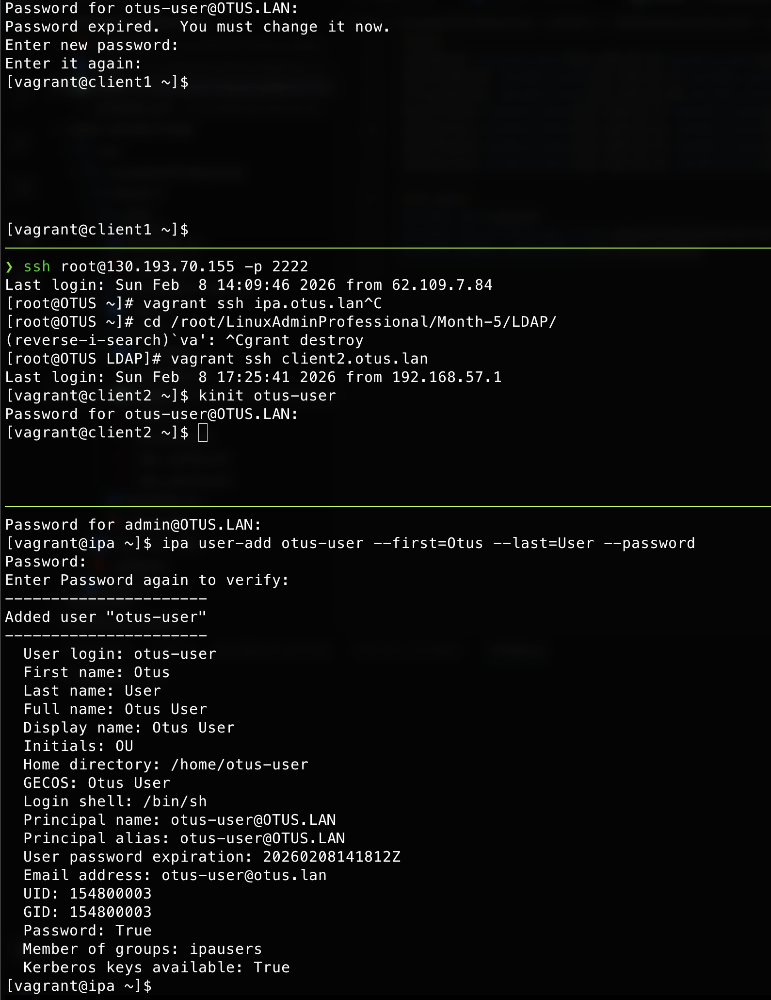
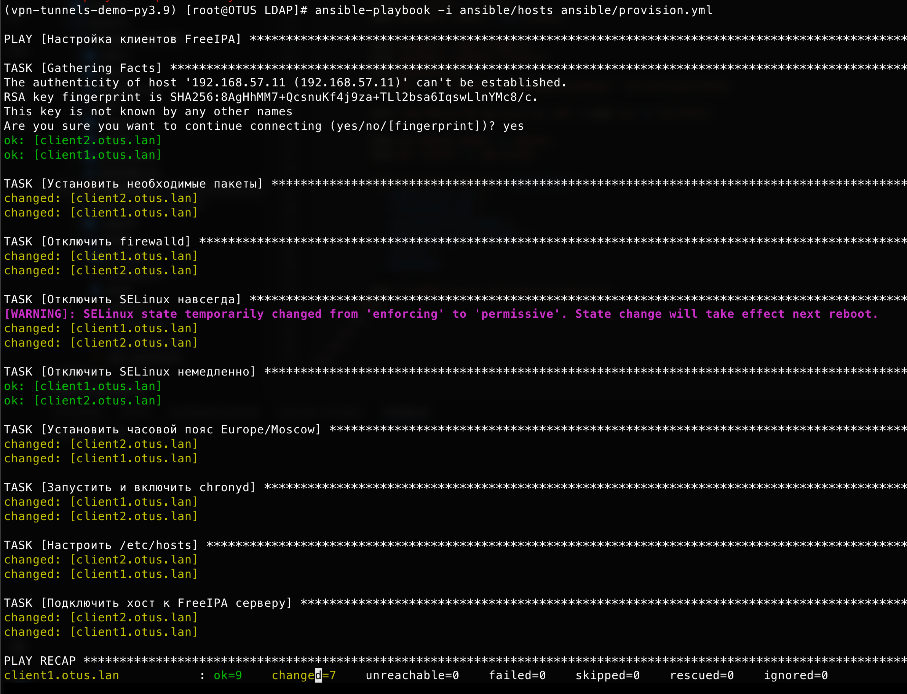
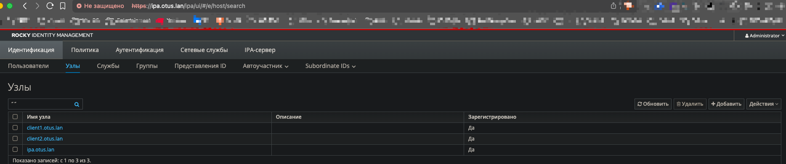

# Домашнее задание: Vagrant-стенд с LDAP на базе FreeIPA

## Название задания
Vagrant-стенд c LDAP на базе FreeIPA

## Цель
Научиться настраивать LDAP-сервер и подключать к нему LDAP-клиентов с помощью Ansible.

## Текст задания
1. Установить FreeIPA-сервер  
2. Написать Ansible-playbook для автоматической конфигурации клиентов  
3. Дополнительно: Настроить аутентификацию по SSH-ключам (выполнено автоматически Vagrant)  
4. Дополнительно: Firewall должен быть включен (в этой работе отключен для упрощения, но можно легко включить обратно)

## Структура репозитория
- `Vagrantfile` — разворачивает 3 виртуальные машины:  
  - ipa.otus.lan (сервер FreeIPA)  
  - client1.otus.lan  
  - client2.otus.lan  
- `ansible/` — всё для Ansible  
  - `hosts` — инвентарь  
  - `provision.yml` — playbook
  - `templates/hosts.j2` — шаблон файла /etc/hosts  
- `README.md` — это документ

| № | Описание                              | Скриншот |
|---|---------------------------------------|----------|
| 1 | Vagrant up завершён                   |  |
| 2 | Установка FreeIPA успешна             |  |
| 3 | Веб-интерфейс FreeIPA                 |  |