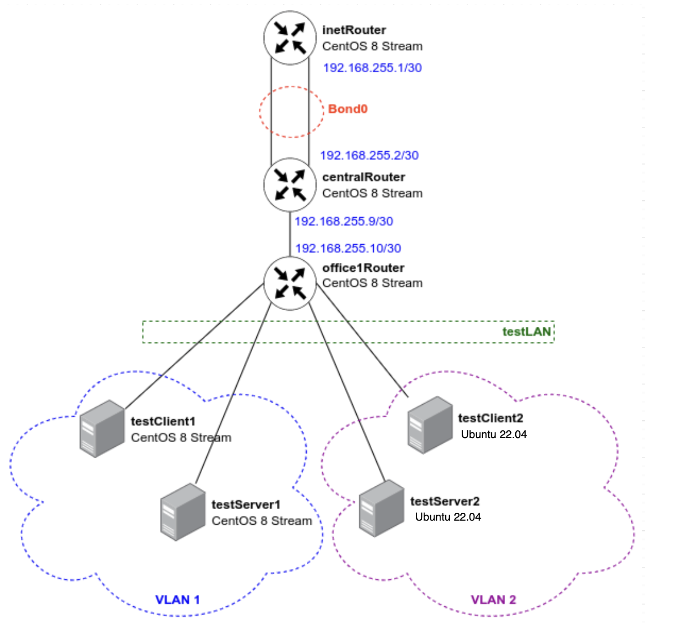
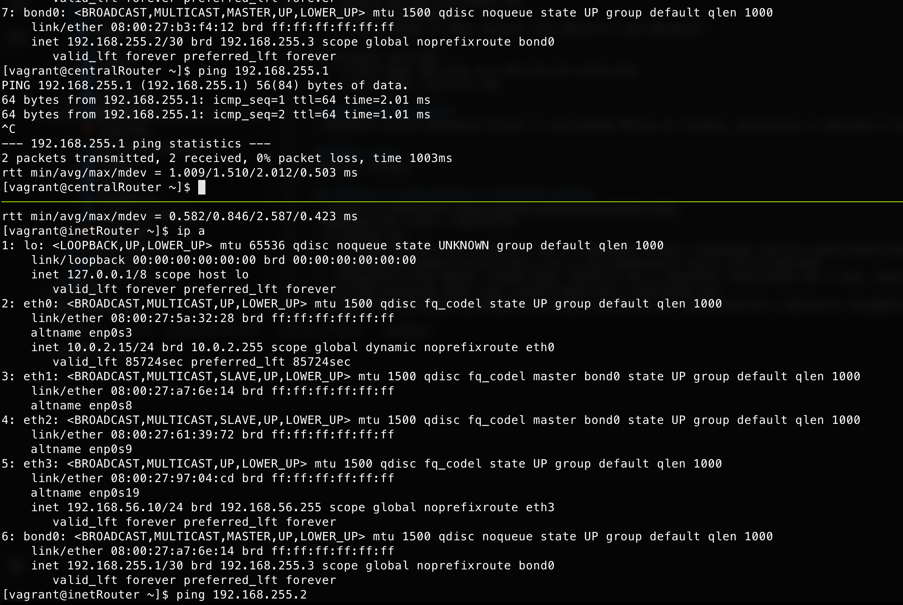
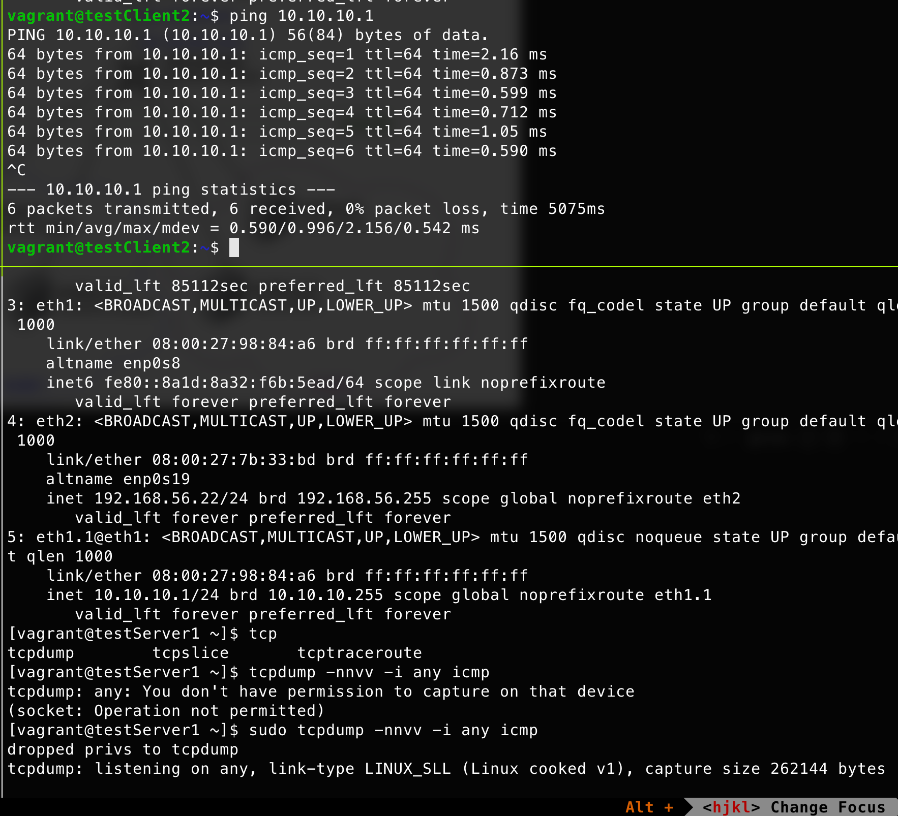

# Домашнее задание: Настройка VLAN и LACP

## Цель работы
Цель данного домашнего задания — изучение и практическая настройка:
- виртуальных локальных сетей (VLAN);
- агрегации каналов с использованием протокола LACP (bonding).

В ходе выполнения задания была развернута тестовая инфраструктура с использованием Vagrant и Ansible, а также проверена корректность работы VLAN и bonding.

---

## Описание задания

### 1. Тестовая инфраструктура Office1

В тестовой подсети Office1 развернуты серверы с дополнительными сетевыми интерфейсами и IP-адресами в internal-сети `testLAN`:

| Хост | IP-адрес |
|------|----------|
| testClient1 | 10.10.10.254 |
| testClient2 | 10.10.10.254 |
| testServer1 | 10.10.10.1 |
| testServer2 | 10.10.10.1 |

---

### 2. Настройка VLAN

Настроены следующие VLAN:

- **VLAN 1**: `testClient1` ↔ `testServer1`
- **VLAN 2**: `testClient2` ↔ `testServer2`

Каждый клиент имеет доступ только к своему серверу в рамках соответствующего VLAN.

---

### 3. Настройка LACP (Bonding)

Между узлами `centralRouter` и `inetRouter`:
- организованы два физических линка в общей internal-сети;
- интерфейсы объединены в bond-интерфейс с использованием LACP (mode 802.3ad);
- проверена отказоустойчивость при отключении интерфейсов.

---

## Схема сети

Схема сети представлена на рисунке ниже:



---

## Файлы проекта

### 1. Vagrantfile

[Vagrantfile](Vagrantfile) разворачивает 7 виртуальных машин:
- 5 машин на CentOS Stream 8
- 2 машины на Ubuntu 22.04

В файле описаны:
- сетевые интерфейсы;
- internal-сети;
- дополнительные адаптеры для VLAN и bonding;
- интеграция с Ansible для автоматической настройки.

---

### 2. Ansible конфигурации

Структура Ansible-проекта:

- [ansible/hosts](ansible/hosts) — inventory-файл с описанием хостов
- [ansible/main.yml](ansible/main.yml) — основной плейбук
- [ansible/provision.yml](ansible/provision.yml) — базовая подготовка систем
- [ansible/vlan_centos.yml](ansible/vlan_centos.yml) — настройка VLAN на CentOS
- [ansible/vlan_ubuntu.yml](ansible/vlan_ubuntu.yml) — настройка VLAN на Ubuntu
- [ansible/bonding.yml](ansible/bonding.yml) — настройка bonding (LACP)
- [ansible/templates/](ansible/templates/) — шаблоны сетевых конфигураций

---

## Развертывание инфраструктуры

Для запуска и настройки инфраструктуры используется команда:

```bash
vagrant up
```

## Результат

Проверка работоспособности бонда после отключения одного интрфейса:



Проверка VLAN

