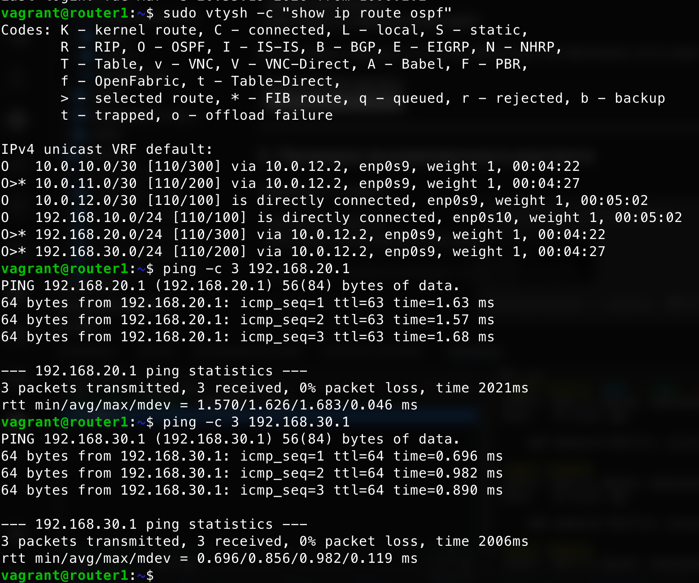
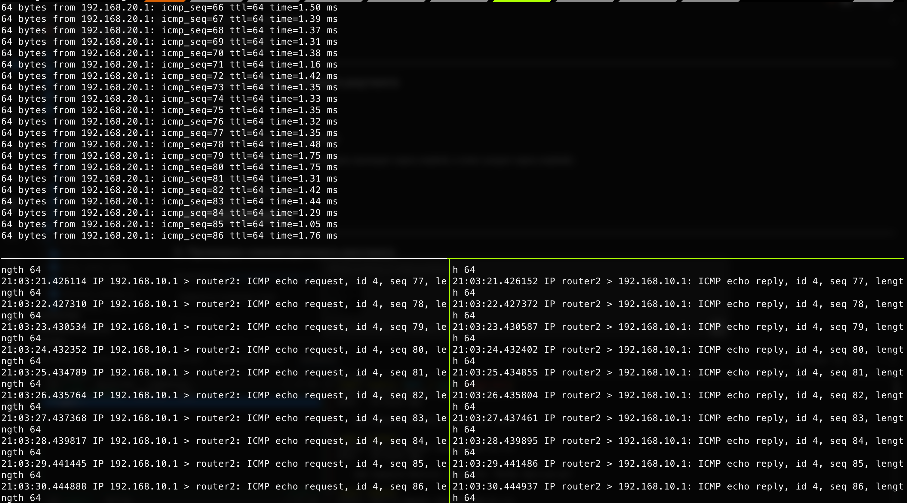
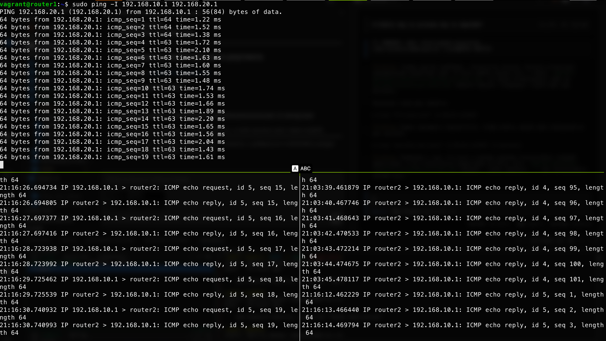

# Домашнее задание: Vagrant-стенд c OSPF

## Цель работы

Создать домашнюю сетевую лабораторию и научиться настраивать протокол OSPF в Linux-based системах.

---

## Описание задания

1. Развернуть 3 виртуальные машины
2. Объединить их разными VLAN
   - настроить OSPF между машинами на базе FRR (Quagga);
   - изобразить ассиметричный роутинг;
   - сделать один из линков «дорогим», но чтобы при этом роутинг был симметричным.

---

## Схема сети

```
         router1 (1.1.1.1)
        /         \
  10.0.10.0/30   10.0.12.0/30
  (r1-r2)         (r1-r3)
      /               \
 router2 (2.2.2.2) -- router3 (3.3.3.3)
          10.0.11.0/30 (r2-r3)

Сети клиентов:
  router1 — 192.168.10.0/24 (net1)
  router2 — 192.168.20.0/24 (net2)
  router3 — 192.168.30.0/24 (net3)

Сеть управления (management):
  router1 — 192.168.56.10
  router2 — 192.168.56.11
  router3 — 192.168.56.12
```

---

## Файлы проекта

### [Vagrantfile](Vagrantfile)

Разворачивает 3 виртуальные машины на базе Ubuntu 20.04 (focal64):

| VM | enp0s8 | enp0s9 | enp0s10 | Management |
|----|--------|--------|---------|------------|
| router1 | 10.0.10.1/30 (r1-r2) | 10.0.12.1/30 (r1-r3) | 192.168.10.1/24 | 192.168.56.10 |
| router2 | 10.0.10.2/30 (r1-r2) | 10.0.11.2/30 (r2-r3) | 192.168.20.1/24 | 192.168.56.11 |
| router3 | 10.0.11.1/30 (r2-r3) | 10.0.12.2/30 (r1-r3) | 192.168.30.1/24 | 192.168.56.12 |

После подъёма последней ВМ (router3) автоматически запускается Ansible-playbook.

### Ansible-конфигурация

| Файл | Описание |
|------|----------|
| [ansible/ansible.cfg](ansible/ansible.cfg) | Базовые настройки Ansible |
| [ansible/hosts](ansible/hosts) | Inventory-файл с router_id для каждого хоста |
| [ansible/provision.yml](ansible/provision.yml) | Основной playbook |
| [ansible/defaults/main.yml](ansible/defaults/main.yml) | Переменные (router_id_enable, symmetric_routing) |
| [ansible/templates/daemons](ansible/templates/daemons) | Шаблон файла FRR daemons (включает zebra и ospfd) |
| [ansible/templates/frr.conf.j2](ansible/templates/frr.conf.j2) | Jinja2-шаблон конфигурации FRR |

---

## Развертывание

```bash
vagrant up
```

---

## Особенности реализации

### 1. Установка и настройка FRR

Используется пакет **FRR** (Free Range Routing) — актуальный преемник Quagga.

Playbook выполняет:
- установку базовых утилит (vim, traceroute, tcpdump, net-tools);
- отключение UFW;
- добавление репозитория и установку FRR;
- включение IP-форвардинга (`net.ipv4.conf.all.forwarding=1`);
- отключение блокировки ассиметричного роутинга (`net.ipv4.conf.all.rp_filter=0`);
- развёртывание конфигурационных файлов `/etc/frr/daemons` и `/etc/frr/frr.conf`;
- перезапуск FRR с добавлением в автозагрузку.

### 2. Jinja2-шаблон frr.conf.j2

Один шаблон генерирует конфигурацию для всех трёх роутеров:
- **`ansible_hostname`** — подставляет имя хоста для `hostname` и выбора блока интерфейсов.
- **`router_id`** — берётся из переменной в файле `hosts` (1.1.1.1 / 2.2.2.2 / 3.3.3.3).
- **`router_id_enable`** — управляет, будет ли `router-id` закомментирован (по умолчанию `true`).

### 3. Ассиметричный роутинг

Управляется переменной **`symmetric_routing: false`** (файл `defaults/main.yml`).

При `false` — интерфейс `enp0s8` на **router1** получает стоимость **1000**. Трафик с router1 до 192.168.20.0/24 идёт через router3, а обратный трафик возвращается напрямую через router2 — маршрут ассиметричен.

Проверка ассиметрии (на router2):
```bash
# Вход → приходит на enp0s9
tcpdump -i enp0s9  # видим ICMP echo request от 192.168.10.1

# Ответ → уходит через enp0s8
tcpdump -i enp0s8  # видим ICMP echo reply на 192.168.10.1
```

### 4. Симметричный роутинг

Чтобы включить симметричный роутинг, установите в `defaults/main.yml`:
```yaml
symmetric_routing: true
```

При `true` — интерфейс `enp0s8` получает стоимость **1000** и на **router1**, и на **router2**. Оба роутера перестают использовать прямой линк r1-r2, трафик между 192.168.10.0/24 и 192.168.20.0/24 ходит через router3 в обоих направлениях.

Применение без полного перезапуска (только 2 последних таска):
```bash
ansible-playbook -i ansible/hosts -l all ansible/provision.yml \
  -t setup_ospf -e "host_key_checking=false" -e "symmetric_routing=true"
```

---

## Результаты проверки

### 1. OSPF-маршруты и базовая связность

На router1 интерфейс `enp0s8` (r1-r2) имеет стоимость 1000, поэтому весь трафик идёт через router3 (enp0s9). Ping до 192.168.20.1 и 192.168.30.1 успешен.



### 2. Ассиметричный роутинг

Запрос от 192.168.10.1 до 192.168.20.1 приходит на router2 через `enp0s9` (от router3), а ответ уходит через `enp0s8` (напрямую к router1) — маршруты разные.



### 3. Симметричный роутинг

После установки `symmetric_routing: true` интерфейс `enp0s8` становится «дорогим» и на router2. Теперь и запрос, и ответ проходят через один интерфейс `enp0s9` на router2.


