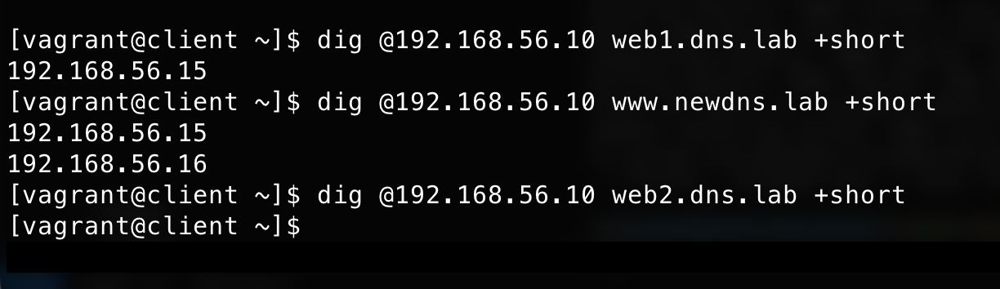
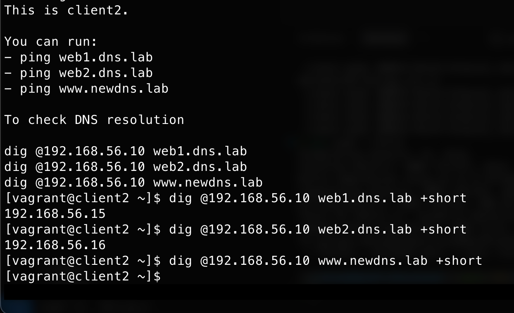

# Домашнее задание: Vagrant-стенд с DNS

## Цель домашнего задания
Создать домашнюю сетевую лабораторию. Изучить основы DNS, научиться работать с технологией Split-DNS в Linux-based системах.

## Описание домашнего задания
1. Взять стенд https://github.com/erlong15/vagrant-bind.
   - Добавить еще один сервер client2.
   - Завести в зоне dns.lab имена:
     - web1 - смотрит на client1 (192.168.50.15).
     - web2 - смотрит на client2 (192.168.50.16).
   - Завести еще одну зону newdns.lab.
   - Завести в ней запись:
     - www - смотрит на обоих клиентов (192.168.50.15 и 192.168.50.16).

2. Настроить split-dns:
   - client1 видит обе зоны, но в зоне dns.lab только web1.
   - client2 видит только dns.lab.

## Дополнительное задание
* Настроить все без выключения SELinux (в этом решении SELinux не отключен, используется по умолчанию в CentOS 7 с permissive или enforcing, но конфиги адаптированы для работы с ним).

## Формат сдачи
Vagrant + Ansible.

## Особенности проектирования и реализации решения
- Основан на репозитории https://github.com/erlong15/vagrant-bind.
- Добавлена VM client2 в Vagrantfile.
- В playbook.yml:
  - Установка пакетов bind, bind-utils, ntp (с отключением chronyd и включением ntpd для синхронизации времени).
  - Использование шаблона servers-resolv.conf.j2 для динамического resolv.conf на ns01/ns02.
  - Копирование зонных файлов, включая новые: named.dns.lab (с web1/web2), named.newdns.lab (с www), named.dns.lab.client (для split-view client).
- Split-DNS реализован через views в master-named.conf и slave-named.conf.
  - Генерация TSIG-ключей (в примере использованы статические для reproducibility; в реальности генерировать tsig-keygen).
  - ACL для client и client2.
  - Views: "client" (для client1: dns.lab с только web1 + newdns.lab), "client2" (для client2: только dns.lab с web1/web2), "default" (остальное).
- На клиентах: resolv.conf указывает на ns01 и ns02.
- NTP: Установлен ntp, chronyd отключен для единообразия.
- Права файлов: Установлены как в пособии (named - 0660, etc.).
- Без отключения SELinux: Bind в CentOS 7 работает с SELinux по умолчанию, если праваcorrect и порты открыты (no custom ports here).
- Заметки:
  - Serial в зонах увеличен для обновлений.
  - Для теста: vagrant up, затем vagrant ssh client/client2/ns01 и dig/ping для проверки.
  - Если ошибки в named.conf, использовать named-checkconf.
  - Ключи TSIG: В реальности генерировать новые для безопасности.
  - Добавлен vim в пакеты для удобства редактирования на VM (опционально).

---

## Скриншоты проверки Split-DNS

### 1. Проверка на client1 (192.168.50.15)
Клиент 1 видит `web1.dns.lab` и `www.newdns.lab`, но не видит `web2.dns.lab`:

### 2. Проверка на client2 (192.168.50.16)
Клиент 2 видит `web1.dns.lab` и `web2.dns.lab`, но не видит зону `newdns.lab` (`www.newdns.lab` не резолвится):
