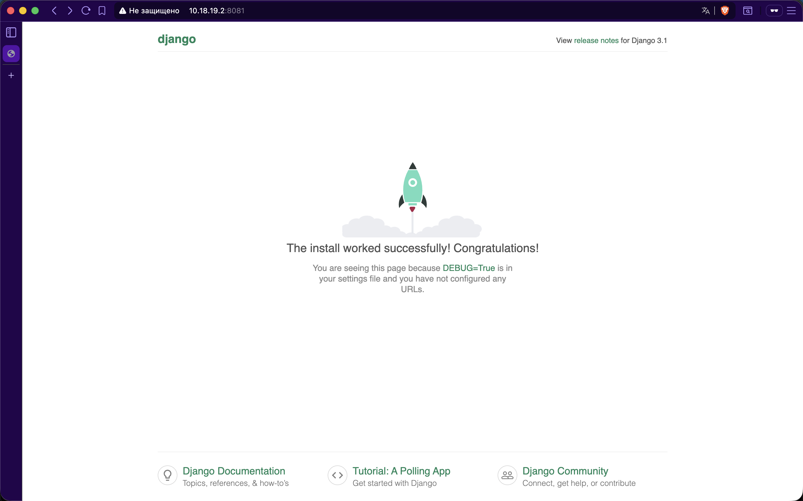
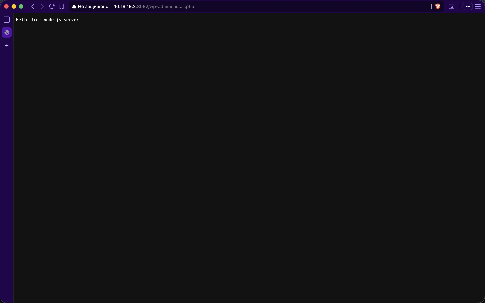
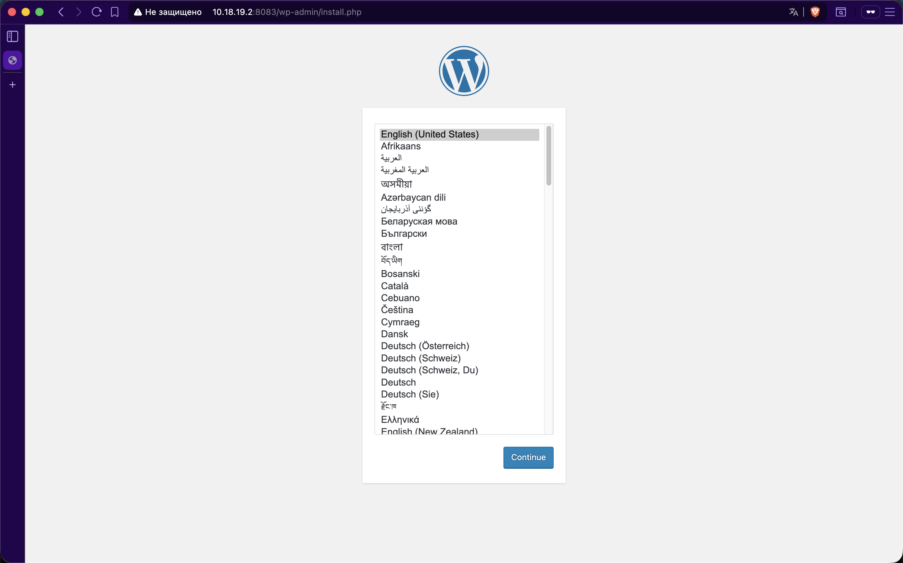

# Dynamic Web Stack - Vagrant + Ansible + Docker

Проект для развертывания многокомпонентного веб-стека с использованием Vagrant, Ansible и Docker Compose.

## 🎯 Цель проекта

Получить практические навыки в настройке инфраструктуры с помощью манифестов и конфигураций. Отточить навыки использования ansible/vagrant/docker.

## 📋 Описание

Стек включает следующие компоненты:
- **Nginx** - веб-сервер и reverse proxy
- **WordPress (PHP-FPM)** - CMS система на порту 8083
- **Django (Python)** - веб-приложение на порту 8081
- **Node.js** - JavaScript сервер на порту 8082
- **MySQL** - база данных для WordPress

Все компоненты развертываются в Docker контейнерах на виртуальной машине Ubuntu 20.04, управляемой Vagrant. Настройка VM автоматизирована с помощью Ansible.

## 🏗️ Структура проекта

```
dynamicweb/
├── project/                        # Директория с приложениями
│   ├── docker-compose.yml          # Docker Compose конфигурация
│   ├── env.example                 # Пример переменных окружения
│   ├── nginx-conf/
│   │   └── nginx.conf              # Конфигурация Nginx для всех приложений
│   ├── node/
│   │   └── test.js                 # Node.js приложение
│   ├── python/
│   │   ├── Dockerfile              # Dockerfile для Django
│   │   ├── manage.py               # Django management
│   │   ├── requirements.txt        # Python зависимости
│   │   └── mysite/                 # Django проект
│   │       ├── __init__.py
│   │       ├── asgi.py
│   │       ├── settings.py
│   │       ├── urls.py
│   │       └── wsgi.py
├── Screenshots/                    # Скриншоты работающих приложений
├── prov.yml                        # Ansible playbook
├── Vagrantfile                     # Конфигурация Vagrant
└── README.md                       # Этот файл
```

## 🚀 Быстрый старт

### Предварительные требования

Установите следующее ПО:
- [VirtualBox](https://www.virtualbox.org/wiki/Downloads) >= 6.0
- [Vagrant](https://www.vagrantup.com/downloads) >= 2.2
- [Ansible](https://docs.ansible.com/ansible/latest/installation_guide/intro_installation.html) >= 2.9

### Установка и запуск

1. **Клонируйте репозиторий:**
```bash
git clone <your-repo-url>
cd dynamicweb
```

2. **Создайте .env файл:**
```bash
cd project
cp env.example .env
cd ..
```

3. **Запустите Vagrant:**
```bash
vagrant up
```

Процесс развертывания займет 10-15 минут. Vagrant выполнит:
- Создание VM с Ubuntu 20.04 (2GB RAM, 2 CPU)
- Установку Docker и Docker Compose через Ansible
- Копирование проекта на VM
- Запуск всех контейнеров

4. **Проверьте приложения:**

После завершения откройте в браузере:

- **Django:** http://localhost:8081/admin/
- **Node.js:** http://localhost:8082/
- **WordPress:** http://localhost:8083/

## 📊 Архитектура

```
┌─────────────────────────────────────────────────┐
│           Host Machine (macOS/Linux)            │
│                 localhost:8081-8083             │
└────────────────────┬────────────────────────────┘
                     │ Port Forwarding
┌────────────────────┴────────────────────────────┐
│         Vagrant VM (Ubuntu 20.04)               │
│         VirtualBox, 2GB RAM, 2 CPU              │
│                                                  │
│  ┌───────────────────────────────────────────┐  │
│  │     Docker Network (app-network)          │  │
│  │                                            │  │
│  │  ┌──────────────────────────────────┐    │  │
│  │  │         Nginx (reverse proxy)     │    │  │
│  │  │    Ports: 8081, 8082, 8083        │    │  │
│  │  └───┬─────────┬──────────┬──────────┘    │  │
│  │      │         │          │                │  │
│  │  ┌───▼────┐ ┌──▼─────┐ ┌─▼────────────┐  │  │
│  │  │ Django │ │ Node.js│ │  WordPress   │  │  │
│  │  │ :8000  │ │ :3000  │ │  :9000 (FPM) │  │  │
│  │  └────────┘ └────────┘ └──────┬───────┘  │  │
│  │                                │          │  │
│  │                          ┌─────▼──────┐   │  │
│  │                          │   MySQL    │   │  │
│  │                          │   :3306    │   │  │
│  │                          └────────────┘   │  │
│  └───────────────────────────────────────────┘  │
└─────────────────────────────────────────────────┘
```

## 🔧 Полезные команды

### Управление Vagrant

```bash
# Запуск VM
vagrant up

# Остановка VM
vagrant halt

# Перезапуск VM
vagrant reload

# Удаление VM
vagrant destroy

# SSH подключение
vagrant ssh

# Повторный провижининг
vagrant provision

# Статус VM
vagrant status
```

### Работа с Docker (внутри VM)

```bash
# Подключиться к VM
vagrant ssh

# Перейти в директорию проекта
cd /home/vagrant/project

# Посмотреть статус контейнеров
docker-compose ps

# Посмотреть логи
docker-compose logs
docker-compose logs nginx
docker-compose logs app

# Перезапустить контейнеры
docker-compose restart

# Остановить контейнеры
docker-compose down

# Запустить контейнеры
docker-compose up -d

# Пересобрать и запустить
docker-compose up -d --build
```

## ✅ Проверка работоспособности

### 1. Django (порт 8081)

```bash
curl http://localhost:8081/admin/
```

В браузере: http://localhost:8081/admin/

Должна отобразиться страница входа в Django Admin.

### 2. Node.js (порт 8082)

```bash
curl http://localhost:8082/
```

Ожидаемый ответ: `Hello from node js server`

### 3. WordPress (порт 8083)

```bash
curl http://localhost:8083/
```

В браузере: http://localhost:8083/

Должна отобразиться страница установки WordPress.

### Проверка контейнеров

```bash
vagrant ssh
cd /home/vagrant/project
docker-compose ps
```

Все 5 контейнеров должны быть в статусе `Up`:
- database
- wordpress
- app
- node
- nginx

## 🐛 Решение проблем

### Порты заняты

Если порты заняты, измените их в `Vagrantfile`:

```ruby
vmconfig.vm.network "forwarded_port", guest: 8083, host: 9083
vmconfig.vm.network "forwarded_port", guest: 8081, host: 9081
vmconfig.vm.network "forwarded_port", guest: 8082, host: 9082
```

### Контейнеры не запускаются

```bash
vagrant ssh
cd /home/vagrant/project
docker-compose logs
docker-compose down
docker-compose up -d --build
```

### Ansible ошибки

```bash
# Проверить установку Ansible
ansible --version

# Повторить провижининг
vagrant provision

# Или перезапустить VM
vagrant destroy
vagrant up
```

### Недостаточно памяти

Уменьшите память в `Vagrantfile`:

```ruby
vbx.memory = "1536"  # вместо 2048
```

## 📝 Технические детали

### Ansible Playbook (prov.yml)

Выполняет следующие задачи:
1. Установка пакетов для Docker
2. Добавление GPG ключа Docker
3. Добавление репозитория Docker
4. Установка Docker CE
5. Добавление пользователя vagrant в группу docker
6. Установка Docker Compose
7. Копирование проекта на VM
8. Запуск контейнеров

### Docker Compose

Определяет 5 сервисов:
- **database** - MySQL 8.0
- **wordpress** - WordPress 5.1.1 FPM Alpine
- **app** - Django (собирается из Dockerfile)
- **node** - Node.js 16.13.2 Alpine
- **nginx** - Nginx 1.15.12 Alpine

Все сервисы работают в одной сети `app-network`.

### Nginx конфигурация

Три виртуальных хоста:
1. **:8083** - FastCGI proxy для WordPress (PHP-FPM)
2. **:8081** - HTTP proxy для Django
3. **:8082** - HTTP proxy для Node.js

## 🔒 Безопасность

⚠️ **Для продакшена необходимо:**

- Изменить пароли в `.env` файле
- Сгенерировать сильный `SECRET_KEY` для Django
- Установить `DEBUG=False` в Django
- Настроить `ALLOWED_HOSTS` в Django settings
- Использовать HTTPS (Let's Encrypt)
- Настроить firewall (ufw/iptables)
- Использовать Docker secrets для паролей
- Регулярно обновлять образы

## 📸 Скриншоты

### Django (порт 8081)


### Node.js (порт 8082)


### WordPress (порт 8083)


## 📚 Дополнительные ресурсы

- [Vagrant Documentation](https://www.vagrantup.com/docs)
- [Ansible Documentation](https://docs.ansible.com/)
- [Docker Compose Documentation](https://docs.docker.com/compose/)
- [Nginx Documentation](https://nginx.org/en/docs/)
- [Django Documentation](https://docs.djangoproject.com/)
- [WordPress Codex](https://codex.wordpress.org/)

## 📄 Критерии оценки

Проект соответствует следующим требованиям:

- ✅ Vagrantfile с настройками VM
- ✅ Ansible playbook для автоматизации
- ✅ Docker Compose для контейнеризации
- ✅ Nginx как reverse proxy
- ✅ Три приложения на разных портах (8081, 8082, 8083)
- ✅ Порты проброшены на localhost
- ✅ Подробная документация в README.md
- ✅ Инструкции по проверке работоспособности
