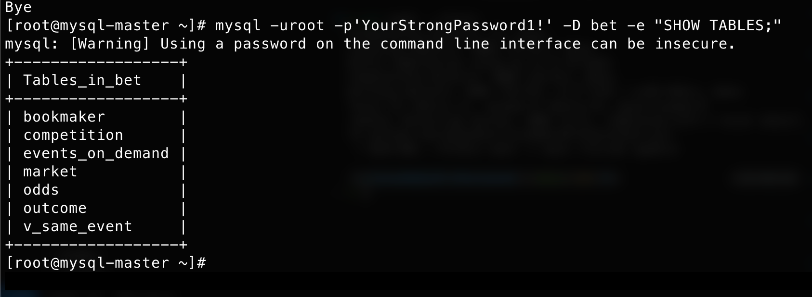
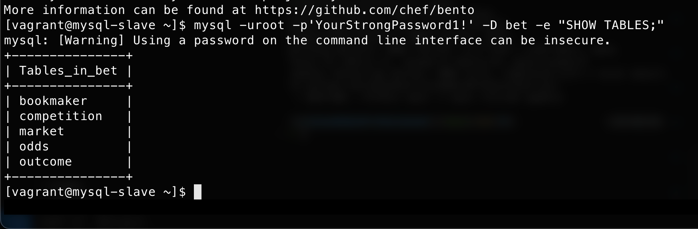
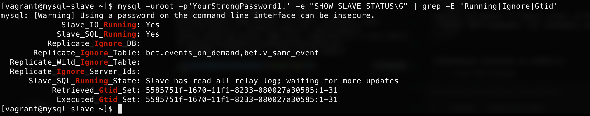

# MySQL Репликация (Percona Server 5.7 + GTID)

Настройка Master-Slave репликации на базе **Percona Server 5.7** с использованием **GTID**.  
Стенд автоматически разворачивается через **Vagrant + Ansible**.

---

## Быстрый старт

```bash
git clone <your-repo-url>
cd Month-6/mysql_replication
vagrant up
```

Vagrant поднимает **два сервера** (CentOS 7) и полностью настраивает их через Ansible:

| VM | IP | Роль |
|---|---|---|
| `master` | 192.168.57.10 | MySQL Master (GTID) |
| `slave`  | 192.168.57.11 | MySQL Slave (GTID, только 5 таблиц) |

После `vagrant up` репликация работает — можно сразу проверять.

---

## Структура проекта

```
mysql_replication/
├── Vagrantfile                          # 2 ВМ: master + slave
├── bet.dmp                              # SQL-дамп тестовой БД bet
├── conf.d/
│   ├── 01-basics.cnf                    # server-id, bind-address
│   └── 05-binlog.cnf                    # GTID, binlog (с закомментир. ignore-table)
└── ansible/
    ├── inventory                        # Хосты и переменные
    ├── site.yml                         # Главный плейбук
    └── roles/mysql/
        ├── files/bet.dmp                # Дамп для роли
        ├── tasks/
        │   ├── main.yml                 # Установка Percona, конфиги, старт MySQL
        │   ├── master.yml               # БД, дамп, пользователь repl
        │   └── slave.yml                # Загрузка дампа, CHANGE MASTER TO, START SLAVE
        ├── handlers/main.yml            # restart mysql
        └── templates/
            ├── 01-basics.cnf.j2         # server_id через Jinja2
            └── 05-binlog.cnf.j2         # GTID + условный replicate-ignore-table
```

---

## Проверка после vagrant up

### Подключиться к мастеру

```bash
vagrant ssh master
mysql -uroot -p'YourStrongPassword1!' -e "SHOW DATABASES;"
mysql -uroot -p'YourStrongPassword1!' -D bet -e "SHOW TABLES;"
```

Ожидаемый вывод (`SHOW TABLES` на мастере — 7 таблиц):

```
+------------------+
| Tables_in_bet    |
+------------------+
| bookmaker        |
| competition      |
| events_on_demand |
| market           |
| odds             |
| outcome          |
| v_same_event     |
+------------------+
```

### Подключиться к слейву

```bash
vagrant ssh slave
mysql -uroot -p'YourStrongPassword1!' -e "SHOW SLAVE STATUS\G" | grep -E 'Running|Ignore|Gtid'
mysql -uroot -p'YourStrongPassword1!' -D bet -e "SHOW TABLES;"
```

Ожидаемый вывод (`SHOW TABLES` на слейве — **5 таблиц**, без `events_on_demand` и `v_same_event`):

```
+---------------+
| Tables_in_bet |
+---------------+
| bookmaker     |
| competition   |
| market        |
| odds          |
| outcome       |
+---------------+
```

Ключевые строки `SHOW SLAVE STATUS\G`:

```
Slave_IO_Running:           Yes
Slave_SQL_Running:          Yes
Replicate_Ignore_Table:     bet.events_on_demand,bet.v_same_event
```

### Проверка репликации в действии

**На мастере:**

```sql
USE bet;
INSERT INTO bookmaker (id, bookmaker_name) VALUES(10, 'testbet');
SELECT * FROM bookmaker;
```

**На слейве** (строка должна появиться сразу):

```sql
USE bet;
SELECT * FROM bookmaker WHERE id = 10;
```

---

## Скриншоты проверки репликации

### 1. Таблицы на Master
Включая `events_on_demand` и `v_same_event`:


### 2. Таблицы на Slave
Репликация `events_on_demand` и `v_same_event` игнорируется:


### 3. Статус репликации
GTID включен, `Slave_IO_Running: Yes`, `Slave_SQL_Running: Yes`:


---

## Содержание

1. [Установка Percona Server 5.7](#1-установка-percona-server-57)
2. [Структура файлов Percona](#2-структура-файлов-percona)
3. [Настройка Master](#3-настройка-master)
4. [Настройка Slave](#4-настройка-slave)
5. [Проверка репликации](#5-проверка-репликации)

---

## 1. Установка Percona Server 5.7

Устанавливаем репозиторий Percona и сам сервер:

```bash
yum install http://www.percona.com/downloads/percona-release/redhat/0.1-6/percona-release-0.1-6.noarch.rpm -y
yum install Percona-Server-server-57 -y
```

---

## 2. Структура файлов Percona

По умолчанию Percona использует следующую структуру:

| Путь | Назначение |
|---|---|
| `/etc/my.cnf` | Основной конфигурационный файл |
| `/etc/my.cnf.d/` | Директория для дополнительных конфигов (инклудится автоматически) |
| `/var/lib/mysql` | Директория с файлами данных |

---

## 3. Настройка Master

### 3.1 Копирование конфигов и запуск сервиса

```bash
cp /vagrant/conf/conf.d/* /etc/my.cnf.d/
systemctl start mysql
```

### 3.2 Получение временного пароля root

При установке Percona автоматически генерирует пароль для пользователя `root` и сохраняет его в лог:

```bash
cat /var/log/mysqld.log | grep 'root@localhost:' | awk '{print $11}'
# Пример вывода: *mulP>&68v/A
```

### 3.3 Смена пароля root

```bash
mysql -uroot -p'*mulP>&68v/A'
```

```sql
ALTER USER USER() IDENTIFIED BY 'YourStrongPassword';
```

### 3.4 Проверка параметров GTID и server-id

Репликация настраивается с использованием **GTID** (Global Transaction Identifiers). Атрибут `server-id` на мастере **обязательно** должен отличаться от `server-id` на слейве.

Проверка текущего `server_id`:

```sql
SELECT @@server_id;
-- +-------------+
-- | @@server_id |
-- +-------------+
-- | 1           |
-- +-------------+
```

Проверка режима GTID:

```sql
SHOW VARIABLES LIKE 'gtid_mode';
-- +---------------+-------+
-- | Variable_name | Value |
-- +---------------+-------+
-- | gtid_mode     | ON    |
-- +---------------+-------+
```

### 3.5 Создание тестовой базы данных

```sql
CREATE DATABASE bet;
```

```bash
mysql -uroot -p -D bet < /vagrant/bet.dmp
```

Проверка загруженных таблиц:

```sql
USE bet;
SHOW TABLES;
-- +------------------+
-- | Tables_in_bet    |
-- +------------------+
-- | bookmaker        |
-- | competition      |
-- | events_on_demand |
-- | market           |
-- | odds             |
-- | outcome          |
-- | v_same_event     |
-- +------------------+
```

### 3.6 Создание пользователя для репликации

```sql
CREATE USER 'repl'@'%' IDENTIFIED BY '!OtusLinux2018';

SELECT user, host FROM mysql.user WHERE user='repl';
-- +------+------+
-- | user | host |
-- +------+------+
-- | repl | %    |
-- +------+------+

GRANT REPLICATION SLAVE ON *.* TO 'repl'@'%' IDENTIFIED BY '!OtusLinux2018';
```

### 3.7 Создание дампа для слейва

Дампим все базы, игнорируя таблицы, которые **не должны реплицироваться** (`events_on_demand` и `v_same_event`):

```bash
mysqldump --all-databases \
          --triggers \
          --routines \
          --master-data \
          --ignore-table=bet.events_on_demand \
          --ignore-table=bet.v_same_event \
          -uroot -p > master.sql
```

> Файл `master.sql` необходимо скопировать на слейв-сервер (например, в `/mnt/master.sql`).

---

## 4. Настройка Slave

### 4.1 Копирование конфигов

```bash
cp /vagrant/conf/conf.d/* /etc/my.cnf.d/
```

### 4.2 Установка уникального server-id

Редактируем `/etc/my.cnf.d/01-basics.cnf`, устанавливаем `server-id = 2`.

Проверка:

```sql
SELECT @@server_id;
-- +-------------+
-- | @@server_id |
-- +-------------+
-- | 2           |
-- +-------------+
```

### 4.3 Настройка игнорируемых таблиц

Раскомментируем в `/etc/my.cnf.d/05-binlog.cnf` строки:

```ini
replicate-ignore-table=bet.events_on_demand
replicate-ignore-table=bet.v_same_event
```

Это указывает слейву игнорировать данные таблицы при репликации.

### 4.4 Заливка дампа мастера

```sql
SOURCE /mnt/master.sql;
```

Проверяем наличие базы и список таблиц — таблиц `v_same_event` и `events_on_demand` быть **не должно**:

```sql
SHOW DATABASES LIKE 'bet';
-- +----------------+
-- | Database (bet) |
-- +----------------+
-- | bet            |
-- +----------------+

USE bet;
SHOW TABLES;
-- +---------------+
-- | Tables_in_bet |
-- +---------------+
-- | bookmaker     |
-- | competition   |
-- | market        |
-- | odds          |
-- | outcome       |
-- +---------------+
```

### 4.5 Подключение и запуск слейва

```sql
CHANGE MASTER TO
  MASTER_HOST = "192.168.11.150",
  MASTER_PORT = 3306,
  MASTER_USER = "repl",
  MASTER_PASSWORD = "!OtusLinux2018",
  MASTER_AUTO_POSITION = 1;

START SLAVE;
```

### 4.6 Проверка статуса слейва

```sql
SHOW SLAVE STATUS\G
```

Ключевые поля вывода:

```
Slave_IO_State:             Waiting for master to send event
Master_Host:                192.168.11.150
Master_User:                repl
Master_Port:                3306
Slave_IO_Running:           Yes
Slave_SQL_Running:          Yes
Replicate_Ignore_Table:     bet.events_on_demand,bet.v_same_event
Retrieved_Gtid_Set:         2861c789-9f2a-11e8-a9fb-525400c9c704:1
Executed_Gtid_Set:          2861c789-9f2a-11e8-a9fb-525400c9c704:1
```

> `Slave_IO_Running: Yes` и `Slave_SQL_Running: Yes` — репликация работает корректно.

---

## 5. Проверка репликации

### На мастере — вставляем запись:

```sql
USE bet;
INSERT INTO bookmaker (id, bookmaker_name) VALUES(1, '1xbet');

SELECT * FROM bookmaker;
-- +----+----------------+
-- | id | bookmaker_name |
-- +----+----------------+
-- |  1 | 1xbet          |
-- |  4 | betway         |
-- |  5 | bwin           |
-- |  6 | ladbrokes      |
-- |  3 | unibet         |
-- +----+----------------+
```

### На слейве — проверяем, что запись появилась:

```sql
SELECT * FROM bookmaker;
-- +----+----------------+
-- | id | bookmaker_name |
-- +----+----------------+
-- |  1 | 1xbet          |
-- |  4 | betway         |
-- |  5 | bwin           |
-- |  6 | ladbrokes      |
-- |  3 | unibet         |
-- +----+----------------+
```

### В binlog слейва можно увидеть событие с GTID:

```
SET @@SESSION.GTID_NEXT= '2861c789-9f2a-11e8-a9fb-525400c9c704:2';
# at 491
# server id 1  thread_id=26  exec_time=0  error_code=0
use `bet`;
INSERT INTO bookmaker (id,bookmaker_name) VALUES(1,'1xbet');
```

---

## Итог

- Репликация **Master → Slave** настроена с использованием **GTID**.
- Таблицы `bet.events_on_demand` и `bet.v_same_event` **исключены** из репликации как на уровне дампа, так и на уровне конфигурации слейва.
- Данные успешно синхронизируются между серверами в реальном времени.
