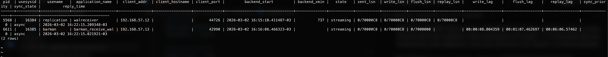
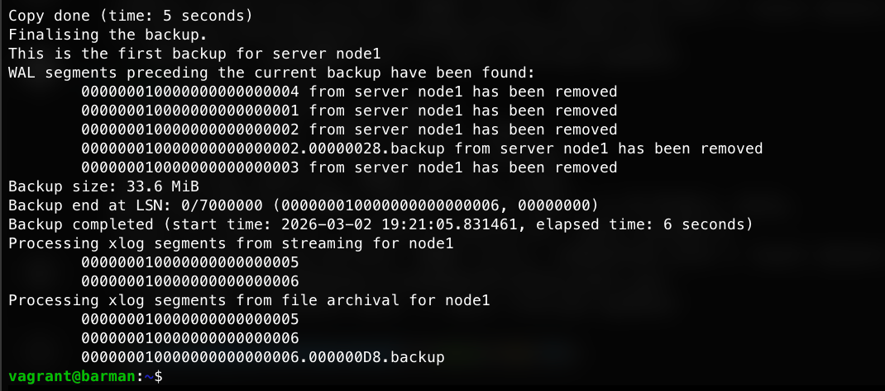
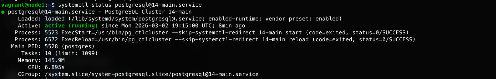

# Репликация и резервное копирование PostgreSQL

## Задание

1. Настроить hot_standby репликацию с использованием слотов
2. Настроить правильное резервное копирование

## Описание стенда

| Хост   | IP             | Роль                   |
|--------|----------------|------------------------|
| node1  | 192.168.57.11  | PostgreSQL master      |
| node2  | 192.168.57.12  | PostgreSQL replica     |
| barman | 192.168.57.13  | Barman (backup server) |

ОС: Ubuntu 22.04 (jammy64), PostgreSQL 14

## Структура проекта

```
postgresql_replication/
├── Vagrantfile
├── README.md
└── ansible/
    ├── hosts
    ├── provision.yml
    └── roles/
        ├── install_postgres/       # Установка PostgreSQL на node1, node2
        ├── postgres_replication/   # Настройка hot_standby репликации
        └── install_barman/         # Настройка резервного копирования Barman
```

## Запуск стенда

```bash
vagrant up
```

Vagrant поднимает три виртуальные машины и при создании последней (barman)
запускает ansible-playbook для настройки всех хостов.

## Часть 1: Hot Standby репликация

### Что делает роль `postgres_replication`

**На node1 (master):**
- Создаёт пользователя `replication` с правами REPLICATION
- Копирует `postgresql.conf` с параметрами: `wal_level = replica`, `max_wal_senders = 3`,
  `max_replication_slots = 3`, `hot_standby = on`
- Копирует `pg_hba.conf` с разрешением репликации от node1 и node2
- Перезапускает PostgreSQL

**На node2 (replica):**
- Останавливает PostgreSQL
- Удаляет содержимое каталога данных `/var/lib/postgresql/14/main/`
- Копирует данные с node1 командой `pg_basebackup -R` (создаёт `standby.signal` и
  настраивает `primary_conninfo` в `postgresql.auto.conf`)
- Копирует `postgresql.conf` с адресом node2 в `listen_addresses`
- Запускает PostgreSQL в режиме hot standby

### Проверка репликации

На node1 — создать БД и проверить репликацию:

```sql
sudo -u postgres psql

-- Создать тестовую базу
CREATE DATABASE otus_test;
\l

-- Проверить состояние репликации
SELECT * FROM pg_stat_replication;
```

На node2 — убедиться что база появилась:

```sql
sudo -u postgres psql

-- Должна появиться otus_test
\l

-- Проверить что нода является репликой
SELECT * FROM pg_stat_wal_receiver;
```

Пример вывода `pg_stat_replication` на node1:
```
-[ RECORD 1 ]----+------------------------------
pid              | 1234
usesysid         | 16384
usename          | replication
application_name | walreceiver
client_addr      | 192.168.57.12
state            | streaming
sent_lsn         | 0/4000148
write_lsn        | 0/4000148
flush_lsn        | 0/4000148
replay_lsn       | 0/4000148
sync_state       | async
```

### Переключение на replica при выходе master из строя

Если node1 недоступен, на node2 выполнить:

```sql
sudo -u postgres psql
SELECT pg_promote();
```

После восстановления node1 его необходимо перевести в режим slave (аналогично
настройке node2 через `pg_basebackup`), а затем при необходимости снова
продвинуть в master через `SELECT pg_promote()`.

## Часть 2: Резервное копирование через Barman

### Что делает роль `install_barman`

- Устанавливает `barman` и `barman-cli` на хост barman
- Устанавливает `barman-cli` на node1 и node2
- Генерирует SSH-ключи для пользователей `postgres` (node1) и `barman` (barman)
- Обменивается публичными ключами между node1 и barman (для rsync/ssh)
- Создаёт суперпользователя `barman` в PostgreSQL на node1
- Добавляет разрешения barman в `pg_hba.conf` на node1 и node2
- Создаёт тестовую БД `otus` и таблицу `test1`
- Копирует конфигурационные файлы: `barman.conf`, `node1.conf`, `.pgpass`
- Запускает `barman switch-wal node1` и `barman cron`

### Проверка barman

На хосте barman (от пользователя barman):

```bash
sudo su - barman

# Проверить соединение с postgres
psql -h 192.168.57.11 -U barman -d postgres -c "\l"

# Проверить репликационное соединение
psql -h 192.168.57.11 -U barman -c "IDENTIFY_SYSTEM" replication=1

# Проверить состояние barman
barman check node1
```

Пример вывода `barman check node1`:
```
Server node1:
    PostgreSQL: OK
    superuser or standard user with backup privileges: OK
    PostgreSQL streaming: OK
    wal_level: OK
    replication slot: OK
    directories: OK
    retention policy settings: OK
    backup maximum age: FAILED (no backups yet)
    minimum redundancy requirements: FAILED (have 0 backups, expected at least 1)
    pg_basebackup: OK
    pg_basebackup compatible: OK
    streaming_archiver: OK
    ...
```

FAILED по `backup maximum age` и `minimum redundancy` — это нормально до первого бэкапа.

### Создание резервной копии

```bash
sudo su - barman
barman backup node1
```

Пример вывода:
```
Starting backup using postgres method for server node1 ...
Backup start at LSN: 0/6000148
Copy done (time: 1 second)
Backup size: 41.8 MiB
Backup completed
```

Добавить в crontab для автоматического бэкапа (например, каждую ночь в 2:00):

```bash
echo "0 2 * * * barman backup node1" | sudo -u barman crontab -
```

### Восстановление из резервной копии

**На barman** — получить список бэкапов и восстановить:

```bash
sudo su - barman

# Список резервных копий
barman list-backup node1
# node1 20221008T010731 - Fri Oct  7 22:07:50 2022 - Size: 41.8 MiB

# Восстановление (node1 должен быть остановлен)
barman recover node1 20221008T010731 /var/lib/postgresql/14/main/ \
  --remote-ssh-command "ssh postgres@192.168.57.11"
```

**На node1** после восстановления:

```bash
sudo systemctl start postgresql
sudo -u postgres psql -c "\l"
```

## Конфигурационные файлы

### postgresql.conf (ключевые параметры)

| Параметр | Значение | Описание |
|---|---|---|
| `wal_level` | `replica` | Включает поддержку репликации |
| `max_wal_senders` | `3` | Максимальное количество слейвов |
| `max_replication_slots` | `3` | Максимальное количество слотов репликации |
| `hot_standby` | `on` | Разрешает read-only запросы на реплике |
| `hot_standby_feedback` | `on` | Реплика сообщает master о своих запросах |
| `password_encryption` | `scram-sha-256` | Метод шифрования паролей |

### pg_hba.conf

Разрешает репликацию пользователю `replication` от node1 и node2,
а также подключение пользователя `barman` (суперпользователь) от barman.

### barman.conf

Хранит глобальную конфигурацию barman: каталог бэкапов, сжатие (gzip),
политику хранения (REDUNDANCY 3, последний бэкап не старше 4 дней).

### node1.conf

Описывает задание бэкапа для сервера node1: SSH-команда, connection string,
метод бэкапа (postgres = pg_basebackup), слот репликации, окно хранения 7 дней.

## Скриншоты

| № | Описание | Скриншот |
|---|----------|----------|
| 1 | Статус репликации на node1: два потоковых подключения — реплика (node2) и barman |  |
| 2 | Успешный бэкап через barman: `pg_basebackup` + WAL из streaming и file archival |  |
| 3 | Сервис PostgreSQL на node1: `active (running)` |  |

## Особенности реализации

- Адаптировано под **Ubuntu 22.04**: конфиги PostgreSQL находятся в `/etc/postgresql/14/main/`,
  а не в каталоге данных (как в RHEL/CentOS). Путь к бинарникам: `/usr/lib/postgresql/14/bin/`.
- `pg_basebackup -R` автоматически создаёт `standby.signal` и записывает `primary_conninfo`
  в `postgresql.auto.conf` (вместо устаревшего `recovery.conf` из PostgreSQL < 12).
- Обмен SSH-ключами между barman и node1 выполняется через `delegate_to` в Ansible.
- После `pg_basebackup` на node2 шаблоны `postgresql.conf` и `pg_hba.conf` перезаписывают
  скопированные с master — это необходимо для корректного адреса `listen_addresses` на реплике.
